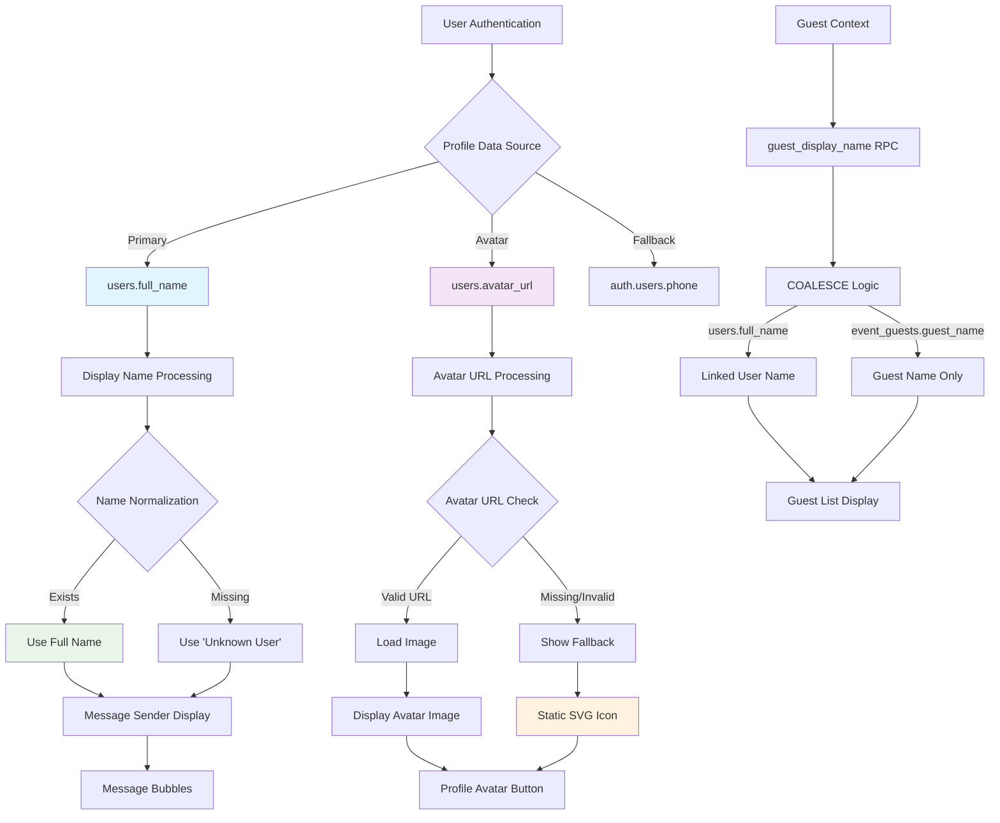

# Avatar Data Flow Analysis

## Current Data Sources

### 1. Users Table (`public.users`)
- **Primary Source**: `users.full_name` (text, nullable)
- **Avatar URL**: `users.avatar_url` (text, nullable)
- **Access Pattern**: Direct query via `supabase.from('users').select('full_name, avatar_url')`
- **RLS**: Protected by user-specific policies

### 2. Auth Metadata (`auth.users`)
- **Fallback Source**: `user.user_metadata.phone` (from useAuth hook)
- **Access Pattern**: `supabase.auth.getUser()` → `user.phone` or `user.user_metadata.phone`
- **Usage**: Currently only for phone display, not avatar

### 3. Guest Display Names (Computed)
- **Source**: `guest_display_name` (computed field from RPC)
- **Fallback Chain**: `COALESCE(users.full_name, event_guests.guest_name)`
- **Access Pattern**: Via `get_guest_event_messages` RPC and guest queries

## Data Flow Diagram

## Current Normalization Logic

### Name Processing
1. **Primary**: `users.full_name` (from profile)
2. **Guest Context**: `guest_display_name` (computed via COALESCE)
3. **Fallback**: `'Unknown User'` or `'Unnamed Guest'`
4. **No trimming or capitalization** currently applied

### Avatar Processing
1. **Check**: `users.avatar_url` exists and is valid
2. **Success**: Render with `next/image` component
3. **Failure**: Show static SVG user icon
4. **No initial-based fallback** currently implemented

## Key Findings

### Missing Functionality
- **No initial extraction** from display names
- **No deterministic color generation** for fallbacks
- **No Unicode-safe name processing** (CJK, RTL, emojis)
- **No consistent sizing system** across components

### Inconsistent Patterns
- **Profile page**: 80px gradient background
- **Profile button**: 20px static icon
- **Message components**: Text-only display
- **No shared avatar component** across contexts

### Data Gaps
- **Avatar URLs present in schema** but not consistently used
- **RPC includes sender_avatar_url** but UI ignores it
- **No avatar upload functionality** implemented
- **No storage bucket for avatars** (only event-media, event-images exist)
