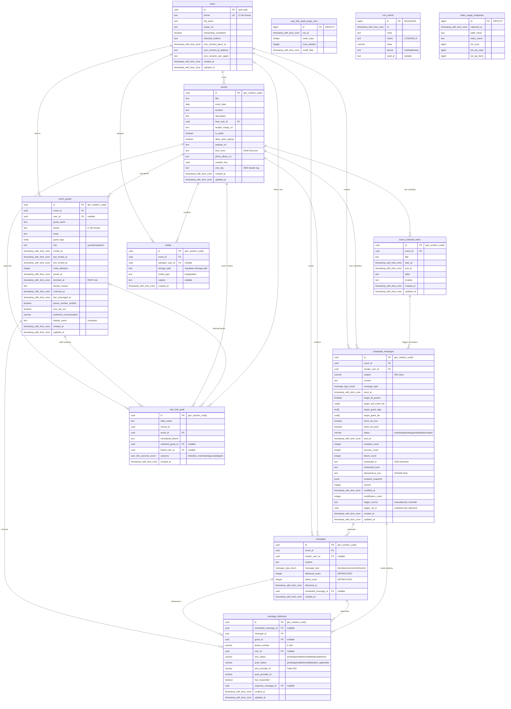

# Entity Relationship Diagram

**Generated:** September 30, 2025  
**Focus:** Core application tables in public schema  

## Mermaid ER Diagram

## Schema Relationships Summary

### Primary Entity Flows

1. **User → Event → Guests**
   - Users create events and become hosts
   - Events have multiple guests (event_guests table)
   - Guests can be linked or unlinked users

2. **Event → Messaging → Deliveries**
   - Events contain messages and scheduled messages
   - Messages generate deliveries to specific guests
   - Delivery tracking per guest per message

3. **Schedule → Reminders → Messages**
   - Schedule items can trigger automatic reminders
   - Reminders create scheduled messages
   - Scheduled messages generate actual messages

### Key Design Patterns

1. **Event-Scoped Data:** All core tables reference events for proper isolation
2. **User-Guest Duality:** Guests can exist without users (phone-only) or be linked to users
3. **Message Delivery Tracking:** Separate delivery records for each recipient
4. **Audit Trail:** Comprehensive linking audit for phone number matching

### Foreign Key Integrity

All foreign key relationships verified with **0 orphan records** detected:
- ✅ event_guests → events (0 orphans)
- ✅ event_guests → users (0 orphans)
- ✅ messages → events (0 orphans)
- ✅ message_deliveries → messages (0 orphans)
- ✅ message_deliveries → event_guests (0 orphans)
- ✅ scheduled_messages → events (0 orphans)

---
*ER diagram generated from live database schema analysis*
