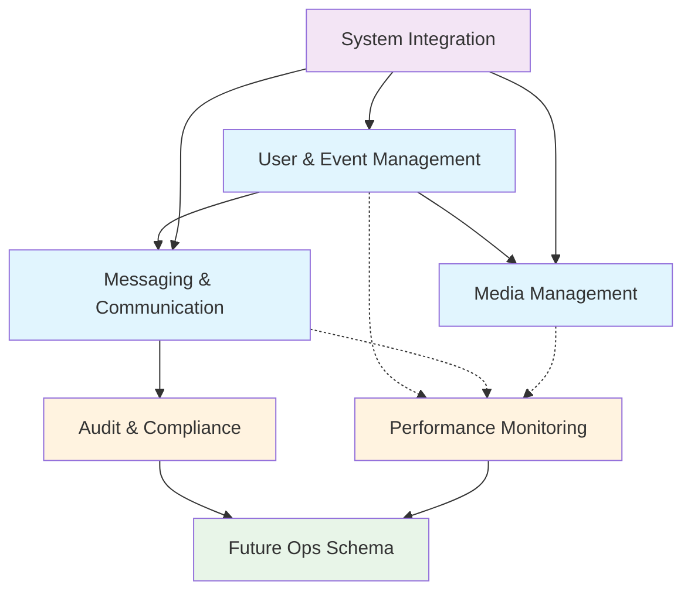

# Core vs Supporting Modules Classification

**Audit Date:** September 30, 2025  
**Analysis:** Table classification by business domain and operational purpose  

## Module Classification Overview

The Unveil database architecture can be classified into **3 primary modules** and **4 supporting modules**:

### 🎯 Core Business Modules

#### 1. **User & Event Management** (4 tables)
**Purpose:** Core business entities and relationships

| Table | Rows | Size | Purpose | Dependencies |
|-------|------|------|---------|--------------|
| `users` | 81 | 88 kB | User accounts & profiles | → auth.users |
| `events` | 3 | 56 kB | Event definitions | → users |
| `event_guests` | 143 | 304 kB | Guest invitations & RSVP | → events, users |
| `event_schedule_items` | 7 | 48 kB | Event timeline/agenda | → events |

**Module Health:** ✅ HEALTHY - Core business logic, well-structured

#### 2. **Messaging & Communication** (3 tables)
**Purpose:** Real-time messaging and scheduled communications

| Table | Rows | Size | Purpose | Dependencies |
|-------|------|------|---------|--------------|
| `messages` | 111 | 208 kB | Direct messages & announcements | → events, users |
| `scheduled_messages` | 45 | 152 kB | Scheduled/automated messaging | → events, users |
| `message_deliveries` | 1,441 | 1,128 kB | SMS/Push delivery tracking | → messages, event_guests |

**Module Health:** ✅ HEALTHY - High activity, proper delivery tracking

#### 3. **Media Management** (1 table)
**Purpose:** Photo/video sharing for events

| Table | Rows | Size | Purpose | Dependencies |
|-------|------|------|---------|--------------|
| `media` | 0 | 40 kB | Event photos & videos | → events, users |

**Module Health:** ✅ READY - Schema ready, awaiting usage

---

### 🔧 Supporting Modules

#### 4. **Audit & Compliance** (2 tables)
**Purpose:** Security auditing and compliance tracking

| Table | Rows | Size | Purpose | Ops Schema Candidate |
|-------|------|------|---------|---------------------|
| `user_link_audit` | 0 | 176 kB | Phone linking audit trail | ✅ YES |
| `user_link_audit_purge_runs` | 1 | 24 kB | Audit cleanup logs | ✅ YES |

**Module Health:** ✅ OPERATIONAL - Active purging, good hygiene

#### 5. **Performance Monitoring** (2 tables + 1 view)
**Purpose:** Application performance and database optimization

| Table | Rows | Size | Purpose | Ops Schema Candidate |
|-------|------|------|---------|---------------------|
| `rum_events` | 164 | 104 kB | Real User Monitoring metrics | ✅ YES |
| `index_usage_snapshots` | 321 | 88 kB | Index usage trend analysis | ✅ YES |
| `rum_p75_7d` | - | - | Performance percentiles (view) | ✅ YES |

**Module Health:** ✅ ACTIVE - Collecting performance data

#### 6. **System Integration** (Supabase Managed)
**Purpose:** Platform integration and system operations

| Schema | Tables | Purpose | Management |
|--------|--------|---------|------------|
| `auth` | 15 tables | Authentication system | Supabase Managed |
| `storage` | 4 tables | File storage system | Supabase Managed |
| `realtime` | 10+ tables | Real-time subscriptions | Supabase Managed |
| `supabase_migrations` | 2 tables | Migration tracking | Supabase Managed |
| `vault` | 1 table | Secrets management | Supabase Managed |

#### 7. **Extensions & Utilities** (System)
**Purpose:** Database extensions and utility functions

| Schema | Purpose | Management |
|--------|---------|------------|
| `extensions` | PostgreSQL extensions (pgcrypto, uuid-ossp, etc.) | System |
| `graphql` | GraphQL API support | Supabase |

---

## Module Dependencies & Data Flow



## Ops Schema Migration Candidates

### 🎯 High Priority for Ops Schema

**Audit & Compliance Module** - Ready for migration
```sql
-- Candidate tables for ops schema:
ops.user_link_audit
ops.user_link_audit_purge_runs
```

**Performance Monitoring Module** - Ready for migration
```sql
-- Candidate tables for ops schema:
ops.rum_events
ops.index_usage_snapshots
ops.rum_p75_7d (view)
```

### Benefits of Ops Schema Separation

1. **Security Isolation:** Separate RLS policies for operational data
2. **Performance:** Reduce query complexity on core business tables
3. **Maintenance:** Easier backup/restore strategies
4. **Compliance:** Clear separation of business vs operational data

### Migration Considerations

- **Low Risk:** Tables have minimal dependencies on core business logic
- **RLS Updates:** Need new policies for ops schema access
- **Application Updates:** Minimal - mostly used by background jobs
- **Rollback Plan:** Simple schema rename if needed

## Table Relationships by Module

### Core Module Interactions
- **High Coupling:** User ↔ Event ↔ Guest (expected for business domain)
- **Medium Coupling:** Messaging ↔ Events (event-scoped messaging)
- **Low Coupling:** Media ↔ Core (independent media uploads)

### Supporting Module Interactions
- **Audit Module:** References core tables for context only
- **Monitoring Module:** Independent data collection
- **System Modules:** Managed by Supabase platform

## Scalability Assessment

### Core Modules
- **Current Scale:** Small (under 200 rows per table)
- **Growth Pattern:** Linear with user/event adoption
- **Bottlenecks:** None identified at current scale
- **Optimization:** Index cleanup recommended

### Supporting Modules
- **Audit Tables:** Automated purging working well
- **Monitoring Tables:** Snapshot-based, manageable growth
- **System Tables:** Managed by platform

## Conclusion

The Unveil database demonstrates **excellent modular architecture** with clear separation of concerns:

- **Core business logic** properly isolated and secured
- **Supporting systems** well-organized and maintainable  
- **Ops schema migration** ready for implementation
- **Scalability patterns** established for future growth

**Architecture Grade: A**

---
*Module analysis based on table relationships, data flow patterns, and operational characteristics*
