# Unveil User Authentication & Authorization Flow

> **Last Updated:** January 2025  
> **Version:** Phase 4 Production Ready  
> **Compatibility:** Supabase Auth v12.2.3+

This document provides a comprehensive overview of how user authentication, authorization, and onboarding work in the Unveil event management platform.

## Table of Contents

1. [User Lifecycle Overview](#user-lifecycle-overview)
2. [Phone Number Auth Flow](#phone-number-auth-flow)
3. [Supabase Integration](#supabase-integration)
4. [Session Management](#session-management)
5. [Edge Cases & Error Handling](#edge-cases--error-handling)
6. [Code Reference](#code-reference)
7. [Authentication Flow Diagram](#authentication-flow-diagram)

---

## User Lifecycle Overview

The Unveil app follows a **phone-first authentication model** with streamlined onboarding. Here's the complete user journey:

### 🔄 Complete User Lifecycle

```text
📱 Phone Entry → 🔐 OTP Verification → 👤 Account Creation → ⚙️ Onboarding → 🎉 App Access
```

### Key Decision Points

| Stage | Condition | Next Action |
|-------|-----------|-------------|
| **OTP Verification** | ✅ Valid OTP | → Check user existence |
| **User Check** | 👤 User exists + onboarding complete | → `/select-event` |
| **User Check** | 👤 User exists + onboarding incomplete | → `/setup` |
| **User Check** | ❌ User doesn't exist | → Create user + `/setup` |
| **Onboarding** | ✅ Setup completed/skipped | → `/select-event` |
| **App Access** | 🎯 Has events | → Event selection |
| **App Access** | 📝 No events | → Event creation |

---

## Phone Number Auth Flow

### 🚀 Authentication Process

The auth flow uses **Supabase Auth** with SMS OTP verification:

#### 1. Phone Number Entry (`/login`)

```typescript
// Validates and normalizes to E.164 format
const normalizedPhone = validatePhoneNumber(phone).normalized;

// Sends OTP via Supabase
await supabase.auth.signInWithOtp({
  phone: normalizedPhone,
  options: { data: { phone: normalizedPhone } }
});
```

#### 2. OTP Verification

```typescript
// Verifies 6-digit code
await supabase.auth.verifyOtp({
  phone: normalizedPhone,
  token: otp,
  type: 'sms'
});
```

### 📊 OTP Flow Outcomes

| Scenario | Supabase Response | App Behavior |
|----------|-------------------|--------------|
| **✅ Successful OTP** | `data.user` populated | → `handlePostAuthRedirect()` |
| **❌ Invalid OTP** | `error.message` set | → Show "Invalid verification code" |
| **⏱️ Expired OTP** | `error.message` set | → Show "Code expired, try again" |
| **🚫 Rate Limited** | HTTP 429 response | → Show "Too many attempts" |

### 🔄 OTP Auto-Submit

- **Auto-submission** when 6 digits entered
- **Duplicate prevention** with loading states
- **Error clearing** on user input

---

## Supabase Integration

### 🗃️ Database Tables

#### **`users` Table Structure**

```sql
CREATE TABLE users (
    id uuid DEFAULT auth.uid() PRIMARY KEY,    -- Supabase Auth UUID
    phone text NOT NULL UNIQUE,                -- E.164 format phone
    full_name text,                            -- User's display name
    avatar_url text,                           -- Profile image URL
    email text,                                -- Optional email
    created_at timestamptz DEFAULT now(),
    updated_at timestamptz DEFAULT now(),
    onboarding_completed boolean DEFAULT false, -- 🔑 KEY FIELD
    intended_redirect text                      -- For deep linking
);
```

#### **Key Column Requirements**

| Column | Required for App Access | Purpose |
|--------|------------------------|---------|
| `id` | ✅ **Required** | Links to Supabase Auth user |
| `phone` | ✅ **Required** | Primary identifier |
| `onboarding_completed` | ✅ **Required** | Gates app access |
| `full_name` | ⚠️ **Optional** | Can be auto-generated or skipped |
| `email` | ❌ **Optional** | Used for notifications |

### 🔐 Row Level Security (RLS)

#### **Users Table Policies**

```sql
-- Users can only access their own records
CREATE POLICY users_select_own ON users FOR SELECT 
  USING (id = (select auth.uid()));

CREATE POLICY users_update_own ON users FOR UPDATE 
  USING (id = (select auth.uid()));

CREATE POLICY users_insert_own ON users FOR INSERT 
  WITH CHECK (id = (select auth.uid()));
```

#### **Auth Functions**

```sql
-- Check if user is event host
CREATE FUNCTION is_event_host(p_event_id uuid) RETURNS boolean;

-- Check if user is event guest  
CREATE FUNCTION is_event_guest(p_event_id uuid) RETURNS boolean;

-- Check if user can access event (host OR guest)
CREATE FUNCTION can_access_event(p_event_id uuid) RETURNS boolean;
```

---

## Session Management

### 🎯 Centralized Auth Provider

The app uses a **single, centralized auth subscription** to prevent race conditions and improve performance:

```typescript
// lib/auth/AuthProvider.tsx
export function AuthProvider({ children }: AuthProviderProps) {
  const [session, setSession] = useState<Session | null>(null);
  const [user, setUser] = useState<User | null>(null);
  const [loading, setLoading] = useState(true);

  useEffect(() => {
    // Single auth state listener for entire app
    const { data: { subscription } } = supabase.auth.onAuthStateChange(
      (event, session) => {
        setSession(session);
        setUser(session?.user ?? null);
        setLoading(false);
      }
    );

    return () => subscription.unsubscribe();
  }, []);
}
```

### 🧭 Post-Auth Redirect Logic

After successful OTP verification, `usePostAuthRedirect` handles routing:

```typescript
// hooks/usePostAuthRedirect.ts
export function usePostAuthRedirect() {
  const handlePostAuthRedirect = async ({ phone, userId }) => {
    // 1. Check if user exists in users table
    const { data: existingUser } = await supabase
      .from('users')
      .select('id, onboarding_completed')
      .eq('id', userId)
      .single();

    if (existingUser) {
      // 2. Route based on onboarding status
      if (existingUser.onboarding_completed) {
        router.replace('/select-event');  // → Ready to use app
      } else {
        router.replace('/setup');         // → Complete onboarding
      }
    } else {
      // 3. Create new user and route to setup
      await supabase.from('users').insert({
        id: userId,
        phone: phone,
        onboarding_completed: false
      });
      router.replace('/setup');
    }
  };
}
```

### 🎯 Route Protection

#### **Landing Page Auto-Redirect** (`app/page.tsx`)

```typescript
useEffect(() => {
  const { data: { session } } = await supabase.auth.getSession();
  
  if (session?.user) {
    const { data: userProfile } = await supabase
      .from('users')
      .select('onboarding_completed')
      .eq('id', session.user.id)
      .single();

    if (userProfile?.onboarding_completed) {
      router.replace('/select-event');
    } else {
      router.replace('/setup');
    }
  }
}, []);
```

#### **Setup Page Protection** (`app/setup/page.tsx`)

- Redirects to `/login` if no authenticated user
- Creates user record if missing (PGRST116 error handling)
- Pre-fills form with existing data if available

---

## Edge Cases & Error Handling

### 🚨 Common Edge Cases

#### **1. User Closes App During Setup**

- **State:** User authenticated in Supabase, but `onboarding_completed = false`
- **Handling:** Next app open → auto-redirect to `/setup`
- **Recovery:** User can complete or skip setup to proceed

#### **2. "Dangling" Supabase Auth Sessions**

- **State:** Supabase session exists, but no record in `users` table
- **Handling:** Setup page creates missing user record automatically
- **Code:** `PGRST116` error (no rows found) triggers user creation

#### **3. Incomplete User Data**

- **State:** User exists but missing `full_name` or other optional fields
- **Handling:** Setup page pre-fills existing data, allows partial completion
- **Fallback:** Auto-generates display name as `"User {last4DigitsOfPhone}"`

#### **4. Session Expiration**

- **State:** Supabase session expires during app use
- **Handling:** Auth state change triggers automatic logout
- **Recovery:** User redirected to login, can immediately re-authenticate

### ⚠️ Error Scenarios & Recovery

| Error Type | Trigger | User Experience | Recovery Action |
|------------|---------|-----------------|-----------------|
| **Invalid OTP** | Wrong 6-digit code | "Invalid verification code" | Re-enter code or request new one |
| **Expired OTP** | Code older than 10 mins | "Code expired" | Automatically request new code |
| **Network Error** | Connection failure | "Connection error, try again" | Retry button available |
| **Rate Limiting** | Too many attempts | "Too many attempts, wait N seconds" | Automatic retry after cooldown |
| **Setup Failed** | Database error during onboarding | "Setup failed, try again" | Retry setup or skip to proceed |

### 🔄 Fallback Mechanisms

1. **Auth Failure → Setup Page:** If post-auth redirect fails, fallback to `/setup`
2. **Missing User → Auto-Creation:** If user missing from database, create automatically  
3. **Setup Errors → Skip Option:** If setup fails, user can skip and complete later
4. **Session Loss → Graceful Logout:** If session invalid, clean logout without errors

---

## Code Reference

### 📁 Key Files & Their Roles

#### **Authentication Entry Points**

- **`app/login/page.tsx`** - Phone + OTP entry form with validation
- **`app/page.tsx`** - Landing page with auto-redirect logic
- **`hooks/usePostAuthRedirect.ts`** - Post-auth routing decision engine

#### **Session & User Management**

- **`lib/auth/AuthProvider.tsx`** - Centralized auth state management
- **`app/setup/page.tsx`** - User onboarding and profile completion
- **`hooks/useAuth.ts`** - Auth context consumer hook

#### **Database & Types**

- **`app/reference/schema.sql`** - Complete database schema with RLS
- **`app/reference/supabase.types.ts`** - TypeScript type definitions
- **`lib/supabase/client.ts`** - Configured Supabase client

#### **Validation & Security**

- **`lib/validations.ts`** - Phone number validation and formatting
- **`middleware.ts`** - Rate limiting and security headers
- **`lib/logger.ts`** - Auth event logging for debugging

#### **UI Components**

- **`components/features/auth/`** - Reusable auth form components
  - `PhoneStep.tsx` - Phone number input component
  - `OTPStep.tsx` - OTP verification component
  - `LogoutButton.tsx` - Session termination

---

## Authentication Flow Diagram

```mermaid
graph TD
    A[📱 User Opens App] --> B{Authenticated?}
    
    B -->|No| C[🔐 Login Page<br/>Phone Entry]
    B -->|Yes| D{User in Database?}
    
    C --> E[📤 Send OTP via Supabase]
    E --> F[🔢 OTP Verification]
    
    F -->|❌ Invalid| G[❌ Show Error<br/>Retry OTP]
    F -->|✅ Valid| H[🎯 handlePostAuthRedirect]
    
    G --> F
    
    H --> I{User Exists?}
    I -->|No| J[👤 Create User Record<br/>onboarding_completed = false]
    I -->|Yes| K{Onboarding Complete?}
    
    J --> L[⚙️ Setup Page<br/>Profile Creation]
    K -->|No| L
    K -->|Yes| M[🎉 Select Event Page]
    
    L --> N{Setup Action?}
    N -->|Complete| O[💾 Save Profile<br/>onboarding_completed = true]
    N -->|Skip| P[⏭️ Mark Complete<br/>Skip profile details]
    
    O --> M
    P --> M
    
    D -->|No| Q[🚨 Create Missing User<br/>Redirect to Setup]
    D -->|Yes| R{Onboarding Complete?}
    
    Q --> L
    R -->|No| L  
    R -->|Yes| M
    
    M --> S[🎯 Event Management<br/>Host/Guest Features]
    
    style A fill:#e1f5fe
    style C fill:#fff3e0
    style F fill:#f3e5f5
    style L fill:#e8f5e8
    style M fill:#e8f5e8
    style S fill:#f1f8e9
```



### 🔄 State Transitions

| Current State | Trigger | Next State | Notes |
|---------------|---------|------------|--------|
| **Unauthenticated** | App open | → Login page | Clean slate |
| **Phone entered** | Valid phone | → OTP verification | SMS sent via Supabase |
| **OTP verified** | Valid code | → User check | Post-auth redirect logic |
| **New user** | First login | → Setup page | Auto-create user record |
| **Returning user** | Re-login | → Setup or Events | Based on onboarding status |
| **Setup complete** | Profile saved | → Event selection | Ready to use app |
| **Setup skipped** | Skip button | → Event selection | Minimal profile created |

---

## Security Considerations

### 🔒 Authentication Security

1. **Phone Validation:** All phone numbers normalized to E.164 format
2. **OTP Security:** 6-digit codes with 10-minute expiration
3. **Rate Limiting:** Middleware prevents brute force attacks
4. **Session Management:** Automatic cleanup on logout/expiration

### 🛡️ Authorization Security

1. **RLS Policies:** All database access governed by Row Level Security
2. **Auth Functions:** Server-side role checking (host/guest/admin)
3. **Event Isolation:** Users can only access their permitted events
4. **Guest Scoping:** Guests limited to specific event contexts

### 🔐 Data Protection

1. **Minimal Data Collection:** Only essential fields required
2. **Secure Storage:** All data encrypted at rest in Supabase
3. **No Client Secrets:** All API keys properly scoped and secured
4. **Audit Logging:** Auth events logged for security monitoring

---

## Performance Optimizations

### ⚡ Auth Performance

1. **Single Subscription:** Centralized auth listener eliminates duplicate subscriptions
2. **Optimized Queries:** Direct user lookups by ID for faster routing decisions
3. **Cached Auth State:** Auth context prevents redundant auth checks
4. **Efficient Redirects:** `router.replace()` prevents back-button issues

### 📊 Database Performance

1. **Indexed Lookups:** Foreign key indexes on all auth-related queries
2. **Optimized RLS:** Auth functions use stable security definer
3. **Minimal Queries:** Only fetch required fields for routing decisions
4. **Connection Pooling:** Supabase handles connection optimization

---

*This document serves as the definitive reference for Unveil's authentication system. For questions or updates, please refer to the commit history or contact the development team.*
