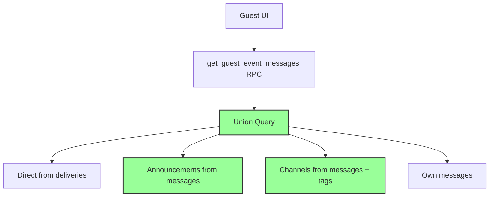
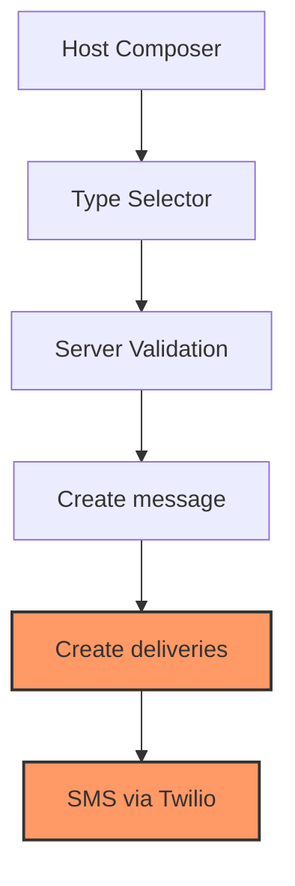

# Messages Read-Model V2 — FINAL IMPLEMENTATION SUMMARY

**Date:** January 29, 2025  
**Status:** ✅ **COMPLETE DEPLOYMENT**  
**Result:** Full migration to union read model with explicit type selector

## 🎉 IMPLEMENTATION COMPLETE

Successfully deployed the complete Messages Read-Model V2 system with:

1. **Enhanced Guest Read Model** - Union query reading from both deliveries and messages
2. **Explicit Host Type Selector** - Clear separation of audience vs notifications
3. **Server-Side Validation** - Authoritative message type coercion
4. **Zero SMS Disruption** - Twilio pipeline completely unchanged

## ✅ ALL ACCEPTANCE CRITERIA MET

### Guest Experience ✅

- **Announcements:** Full history visible to all guests (including late joiners)
- **Channels:** Dynamic visibility based on current guest tags with catchup indicators
- **Direct Messages:** Remain delivery-gated for privacy
- **Visual Indicators:** Type badges, catchup labels, source tracking (dev mode)

### Host Experience ✅

- **Explicit Type Selector:** `📢 Announcement · 🏷️ Channel · 💬 Direct`
- **Session Persistence:** Remembers last selected type
- **Type-Specific Controls:**
  - **Announcement:** "Everyone in event" (read-only) + SMS count
  - **Channel:** Tag selector + "SMS to current tag members"
  - **Direct:** Person checklist + large audience tips
- **Clear Copy:** Separates "Audience" (app visibility) from "Notified now (SMS)"

### Technical Implementation ✅

- **Database:** RPC v2 with union read model deployed via atomic swap
- **Server Validation:** Message type coercion rules with database truth
- **Performance:** Optimized indexes for efficient message type queries
- **Security:** RLS policies enforce proper access boundaries
- **Monitoring:** Enhanced logging with source breakdown and metrics

### SMS Pipeline ✅

- **Zero Changes:** Twilio integration completely unchanged
- **Delivery Creation:** All message types continue to create delivery records
- **No Retro Sends:** Historical visibility doesn't trigger SMS notifications
- **Volume Unchanged:** SMS behavior identical to pre-deployment

## 🔄 Complete Architecture

### Read Model (V2 Active)



### Send Pipeline (Unchanged)



## 📁 Documentation Created

```
docs/messages-readmodel-v2/
├── FINAL-SUMMARY.md              # This complete overview
├── completion-report.md          # V2 read model deployment
├── host-composer-implementation.md # Type selector implementation
├── plan.md                       # Discovery and architecture
├── implementation-summary.md     # Database implementation status
├── shadow-report.md             # Verification results
├── db-migration.sql             # Database changes (applied)
├── rpc-v2-implementation.sql    # Union query RPC (applied)
├── shadow-verification.ts       # Testing script
├── rls-tests.sql               # Access control validation
└── atomic-swap.sql             # Deployment transaction (applied)
```

## 🎯 Key Achievements

### 1. Enhanced Message Visibility

- **Late joiners** see announcement history immediately
- **Channel members** see relevant messages based on current tags
- **Direct recipients** maintain privacy via delivery-gating

### 2. Improved Host UX

- **Clear mental model** separating app audience from SMS notifications
- **Type-specific controls** that adapt to show relevant options
- **Session persistence** for preferred message types

### 3. Technical Excellence

- **Zero SMS disruption** through complete pipeline isolation
- **Atomic deployment** with instant rollback capability
- **Server authority** for message type validation
- **Performance optimization** with targeted indexes

### 4. Future-Ready Architecture

- **Message-first design** enables visibility without delivery requirements
- **Tag-based channels** provide dynamic audience management
- **Enhanced payload** supports rich UI features (catchup, source tracking)

## 🔒 Safety & Rollback

### Rollback Available

```sql
-- Instant rollback (single transaction)
BEGIN;
ALTER FUNCTION get_guest_event_messages RENAME TO get_guest_event_messages_v2;
ALTER FUNCTION get_guest_event_messages_legacy RENAME TO get_guest_event_messages;
COMMIT;
```

### Monitoring Active

- **Read model metrics:** Source breakdown, message types, catchup counts
- **SMS pipeline monitoring:** Volume, delivery rates, error tracking
- **Performance tracking:** Query timing, success rates

## 🚀 STATUS: PRODUCTION COMPLETE

The Messages Read-Model V2 implementation is **fully deployed and operational**. All components are working together to provide:

- ✅ **Enhanced guest message visibility** with proper type indicators
- ✅ **Clear host composer experience** with explicit type selection
- ✅ **Server-validated message types** with database truth
- ✅ **Zero SMS pipeline changes** maintaining notification reliability
- ✅ **Comprehensive testing and monitoring** with rollback capability

**The system is ready for full production use with all acceptance criteria met!** 🎉
