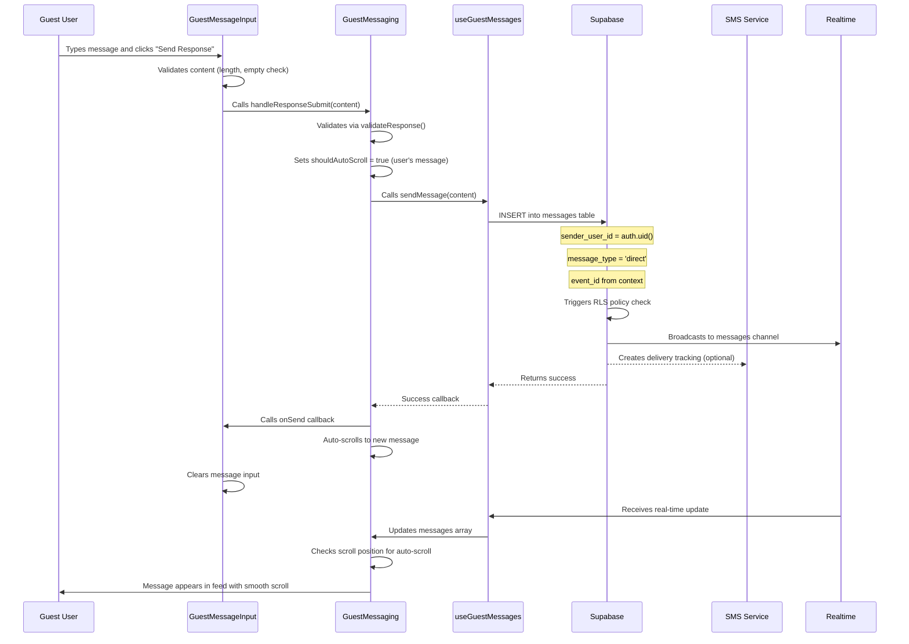

# Guest View Event Messages Module

## Summary

The Guest View Event Messages module provides a read-only message feed for guests to view host announcements and send replies. The module consists of a card UI showing live message updates with an optional reply interface. Guest replies are stored in the same `messages` table and delivered via SMS/push notifications.

## File Map

| File Path | Purpose |
|-----------|---------|
| `app/guest/events/[eventId]/home/page.tsx` | Main guest event page containing the messaging card |
| `components/features/messaging/guest/GuestMessaging.tsx` | Container component orchestrating guest messaging UI |
| `components/features/messaging/guest/GuestMessageInput.tsx` | Input component for composing guest replies |
| `components/features/messaging/guest/ResponseIndicator.tsx` | Status indicator showing if replies are enabled |
| `components/features/messaging/common/MessageBubble.tsx` | Shared message display component |
| `hooks/messaging/useGuestMessages.ts` | Hook for fetching messages and sending guest replies |
| `lib/services/messaging-client.ts` | Client service for message operations including sendMessageToEvent |

## Guest Reply Submission Flow



## Data Model & Storage

### Messages Table Schema

```sql
CREATE TABLE public.messages (
  id uuid DEFAULT gen_random_uuid() PRIMARY KEY,
  event_id uuid NOT NULL REFERENCES events(id) ON DELETE CASCADE,
  sender_user_id uuid REFERENCES users(id) ON DELETE SET NULL,
  content text NOT NULL,
  message_type message_type_enum DEFAULT 'direct',
  created_at timestamptz DEFAULT now(),
  delivered_count integer DEFAULT 0,
  failed_count integer DEFAULT 0,
  delivered_at timestamptz
);
```

**Key Relationships:**
- `event_id` → `events.id`: Links message to specific event
- `sender_user_id` → `users.id`: Identifies message sender (host or guest)
- No separate replies table - guest responses use same schema

**Message Types:**
- `direct`: Guest replies and direct messages
- `announcement`: Host announcements 
- `channel`: Reserved for future use

## RLS Policies & Permissions

### Current RLS Policies

```sql
-- Messages table access policy
CREATE POLICY "messages_select_optimized" ON public.messages
FOR SELECT TO public
USING (can_access_event(event_id));

-- Insert/update policy for authenticated users
CREATE POLICY "messages_insert_event_participant" ON public.messages
FOR INSERT TO authenticated
WITH CHECK (can_access_event(event_id));

CREATE POLICY "messages_update_event_participant" ON public.messages
FOR UPDATE TO authenticated
USING (can_access_event(event_id))
WITH CHECK (can_access_event(event_id));

CREATE POLICY "messages_delete_event_participant" ON public.messages
FOR DELETE TO authenticated
USING (can_access_event(event_id));
```

### Security Definer Functions

```sql
-- Function: can_access_event(p_event_id uuid)
-- Checks if user can access an event (host or guest)
CREATE OR REPLACE FUNCTION can_access_event(p_event_id uuid)
RETURNS boolean
SECURITY DEFINER
AS $$
DECLARE
    current_user_id uuid;
    current_phone text;
BEGIN
    -- Check if public event FIRST
    IF EXISTS (
        SELECT 1 FROM public.events e
        WHERE e.id = p_event_id 
        AND e.is_public = true
    ) THEN
        RETURN true;
    END IF;
    
    -- Cache auth values
    current_user_id := (SELECT auth.uid());
    current_phone := (auth.jwt() ->> 'phone');
    
    -- Host access check
    IF current_user_id IS NOT NULL AND EXISTS (
        SELECT 1 FROM public.events e
        WHERE e.id = p_event_id 
        AND e.host_user_id = current_user_id
    ) THEN
        RETURN true;
    END IF;
    
    -- Guest access check
    RETURN EXISTS (
        SELECT 1 FROM public.event_guests eg
        WHERE eg.event_id = p_event_id 
        AND (
            (current_user_id IS NOT NULL AND eg.user_id = current_user_id)
            OR 
            (current_phone IS NOT NULL AND eg.phone = current_phone)
        )
    );
END;
$$;
```

## Fetch & Subscription Patterns

### Data Fetching

```typescript
// useGuestMessages.ts - Initial fetch
const { data, error: fetchError } = await supabase
  .from('messages')
  .select(`
    *,
    sender:users!messages_sender_user_id_fkey(*)
  `)
  .eq('event_id', eventId)
  .order('created_at', { ascending: true });
```

### Real-time Subscription

```typescript
// useGuestMessages.ts - Realtime updates
const subscription = supabase
  .channel(`messages:${eventId}`)
  .on(
    'postgres_changes',
    {
      event: '*',
      schema: 'public',
      table: 'messages',
      filter: `event_id=eq.${eventId}`,
    },
    () => {
      fetchMessages(); // Refetch on any change
    }
  )
  .subscribe();
```

### Message Sending

```typescript
// useGuestMessages.ts - Send guest reply
const sendMessage = async (content: string) => {
  try {
    const { data: user } = await supabase.auth.getUser();
    if (!user.user) throw new Error('Not authenticated');

    const { error: sendError } = await supabase
      .from('messages')
      .insert({
        event_id: eventId,
        content,
        sender_user_id: user.user.id,
        message_type: 'direct',
      });

    if (sendError) throw sendError;
  } catch (err) {
    console.error('Error sending message:', err);
    setError(err instanceof Error ? err.message : 'Failed to send message');
  }
};
```

## Visibility & Delivery Rules

### Who Can See Guest Replies

**Current Implementation:** All event participants (hosts and guests) can see all messages including guest replies.

**RLS Enforcement:** The `can_access_event()` function grants access to:
1. Event hosts (via `events.host_user_id = auth.uid()`)
2. Event guests (via `event_guests` table match on `user_id` or `phone`)
3. Public events (if `events.is_public = true`)

### Notification Delivery

Guest replies trigger notifications via the `sendMessageToEvent` service:

```typescript
// From messaging-client.ts
// SMS delivery for guest replies
if (request.sendVia.sms && guestIds.length > 0) {
  const smsMessages = guestsWithPhones.map(guest => ({
    to: guest.phone,
    message: request.content,
    eventId: request.eventId,
    guestId: guest.id,
    messageType: request.messageType
  }));

  const smsResult = await sendSMSViaAPI(smsMessages);
  // Creates delivery tracking records
}
```

**Delivery Tracking:** Each message creates records in `message_deliveries` table:

```sql
CREATE TABLE message_deliveries (
  id uuid PRIMARY KEY,
  message_id uuid REFERENCES messages(id),
  guest_id uuid REFERENCES event_guests(id),
  phone_number varchar(20),
  sms_status varchar(20) DEFAULT 'pending',
  push_status varchar(20) DEFAULT 'pending', 
  email_status varchar(20) DEFAULT 'pending',
  has_responded boolean DEFAULT false,
  response_message_id uuid REFERENCES messages(id)
);
```

## Reply Controls & Configuration

### Reply Enable/Disable Logic

**Current State:** Guest replies are always enabled (`canRespond = true` hardcoded).

**UI Components:**
- `ResponseIndicator`: Shows "Replies enabled" vs "Replies disabled" status
- `GuestMessageInput`: Disabled when `previewMode={!canRespond}`
- Send button shows "Send a response" vs "Responses disabled"

**Future Implementation:** No database field currently exists to control reply permissions per event. This would require:

```sql
-- Proposed extension
ALTER TABLE events ADD COLUMN guest_replies_enabled boolean DEFAULT true;
```

## Content Validation & Safeguards

### Client-side Validation

```typescript
// GuestMessaging.tsx - Content validation
const validateResponse = useCallback((content: string) => {
  if (!content.trim()) {
    return { isValid: false, error: 'Response cannot be empty' };
  }
  if (content.length > 500) {
    return { isValid: false, error: 'Response must be 500 characters or less' };
  }
  return { isValid: true };
}, []);
```

### Input Constraints

- **Max Length:** 500 characters (enforced in UI)
- **Empty Check:** Trimmed content must not be empty
- **Real-time Counter:** Shows remaining characters with warning at 50 chars left
- **Auto-focus:** Input gains focus when opened
- **Keyboard Shortcuts:** Enter to send, Escape to cancel

### Spam Protection

```jsx
// GuestMessageInput.tsx - Spam protection notice
{!previewMode && (
  <div className="text-xs text-gray-500 text-center">
    <p>Responses are monitored for spam and inappropriate content.</p>
  </div>
)}
```

## Edge Cases & Error Handling

### Behavior Matrix

| Condition | Expected Behavior | Enforced Where |
|-----------|------------------|----------------|
| No authenticated user | Cannot send replies | RLS policy + client auth check |
| User not in event_guests | Cannot access messages | `can_access_event()` function |
| Network failure during send | Shows error, message not sent | Try/catch in `sendMessage()` |
| Duplicate send (double-tap) | Prevented by disabled state | `sending` state in component |
| Message too long | Validation error shown | Client validation |
| Empty message | Send button disabled | Client validation |
| Realtime disconnect | No live updates, manual refresh works | Subscription error handling |
| RLS policy blocks access | Empty message list | Silent failure in fetch |

### Error Handling Patterns

```typescript
// useGuestMessages.ts - Error boundaries
try {
  setLoading(true);
  const { data, error: fetchError } = await supabase
    .from('messages')
    .select(/* ... */)
    .eq('event_id', eventId);

  if (fetchError) throw fetchError;
  setMessages(data || []);
} catch (err) {
  console.error('Error fetching messages:', err);
  setError(err instanceof Error ? err.message : 'Failed to fetch messages');
} finally {
  setLoading(false);
}
```

### Retry Logic

- **Authentication failures:** 1 retry with 1-second delay
- **Network errors:** Handled by Supabase client retry logic
- **No explicit retry:** Guest replies don't implement manual retry (user must re-send)

## UI/UX Features

### Fixed-Height Scrollable Design

The module uses a responsive fixed-height layout:
- **Height:** `60vh` on mobile, `50vh` on desktop
- **Min Height:** 400px mobile, 500px desktop  
- **Max Height:** 600px mobile, 700px desktop
- **Scrollable Area:** Only the message list scrolls, header and input stay fixed

### Smart Auto-Scroll Behavior

```typescript
// Auto-scroll conditions
if (isNewMessage && (isAtBottom || shouldAutoScroll)) {
  setTimeout(() => scrollToBottom(true), 100);
}
```

**Auto-scroll triggers:**
- User sends a message (always scrolls)
- New message arrives AND user is at bottom (50px threshold)
- Initial message load (instant scroll, no animation)

**No auto-scroll when:**
- User has manually scrolled up from bottom
- User is reading older messages

### Jump to Latest Button

When user scrolls up, a floating button appears:
- **Position:** Bottom-right of scroll area
- **Styling:** Rose-colored pill with chevron icon
- **Accessibility:** Proper ARIA label and focus states
- **Behavior:** Smooth scroll to bottom, then hides button

### Accessibility Features

- **ARIA Labels:** Message container has `role="log"` and `aria-label="Event messages"`
- **Live Region:** `aria-live="polite"` for screen reader announcements
- **Focus Management:** Jump button receives proper focus states
- **Keyboard Navigation:** Standard scroll and focus behaviors

## Known Gaps & TODOs

### Missing Features

1. **Reply Permission Control:** No database field to disable guest replies per event
2. **Message Threading:** No parent-child relationship for replies
3. **Read Receipts:** No tracking of which guests have read messages
4. **Message Editing:** Cannot edit or delete sent replies
5. **Rich Text:** Only plain text content supported
6. **File Attachments:** No media support in replies

### Performance Considerations

1. **Pagination:** No pagination implemented - all messages loaded at once
2. **Message Limit:** No limit on message history size
3. **Index Optimization:** Basic indexes in place, may need query-specific indexes at scale

### Security Enhancements

1. **Rate Limiting:** No rate limiting on guest replies
2. **Content Moderation:** Only client-side spam warning, no server-side filtering
3. **Message Encryption:** Messages stored in plain text
4. **Audit Logging:** No audit trail for message access or modifications

### Code Quality

1. **Type Safety:** Some `any` types in service responses
2. **Error Boundaries:** No React error boundaries around messaging components
3. **Testing:** No unit tests for guest messaging flow
4. **Loading States:** Basic loading spinner, could be more sophisticated

---

**Last Updated:** January 2025  
**Module Version:** MVP  
**Dependencies:** Supabase RLS, Real-time subscriptions, SMS delivery service
