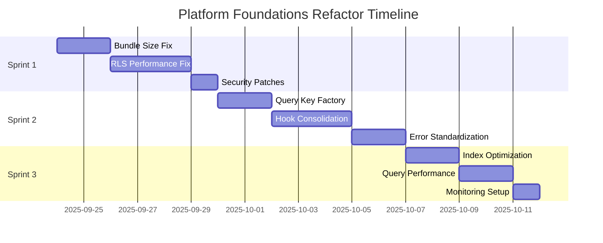

# Platform Foundations Refactor Plan
*Generated: September 24, 2025*

## 🎯 Sprint-Based Implementation Plan

### Foundation Sprint 1: Performance & Security Critical Path
**Duration**: 1-2 weeks | **Priority**: P0 Issues | **Team**: 2-3 developers

#### Sprint Goal
Address critical performance bottlenecks and security vulnerabilities that impact all users and create immediate business value.

#### Sprint Scope

##### 1. Bundle Size Emergency Fix 🚨 **P0**
**Problem**: 676KB shared bundle (177% over target), affecting Core Web Vitals

**Tasks**:
- [ ] **Dynamic import React Query provider** (4h)
  ```typescript
  // Current: Synchronous import causing bundle bloat
  import { ReactQueryProvider } from '@/lib/react-query-client';
  
  // Target: Route-based lazy loading
  const ReactQueryProvider = dynamic(() => import('@/lib/react-query-client'), {
    loading: () => <QueryLoadingSpinner />,
    ssr: false
  });
  ```

- [ ] **Dynamic import Supabase client in providers** (4h)
- [ ] **Optimize Lucide icon imports** (2h)
  ```typescript
  // Current: Full library import
  import { MessageCircle } from 'lucide-react';
  
  // Target: Specific icon import (already configured in next.config.ts)
  import MessageCircle from 'lucide-react/dist/esm/icons/message-circle';
  ```

- [ ] **Route-specific provider chunking** (6h)

**Success Criteria**:
- [ ] Main-app bundle < 400KB (currently 676KB)
- [ ] Shared chunk < 200KB (currently ~300KB)
- [ ] First Load JS improvement >20%

##### 2. Database RLS Performance Fix 🚨 **P0**  
**Problem**: 12+ overlapping RLS policies causing 300% query overhead

**Tasks**:
- [ ] **Audit current RLS policies** (2h)
- [ ] **Design consolidated policy structure** (4h)
  ```sql
  -- Current: Multiple overlapping policies
  POLICY "event_guests_host_management" FOR ALL USING (is_event_host(auth.uid(), event_id));
  POLICY "event_guests_self_access" FOR ALL USING (user_id = auth.uid());
  
  -- Target: Single comprehensive policy  
  POLICY "event_guests_unified_access" FOR ALL USING (
    is_event_host(auth.uid(), event_id) OR user_id = auth.uid()
  );
  ```

- [ ] **Create migration for policy consolidation** (6h)
- [ ] **Test policy changes thoroughly** (4h)
- [ ] **Deploy with rollback plan** (2h)

**Success Criteria**:
- [ ] <3 policies per table action
- [ ] 40%+ query performance improvement
- [ ] Zero functional regressions

##### 3. Security Vulnerability Patch 🔒 **P0**
**Problem**: 3 functions with mutable search_path security risk

**Tasks**:
- [ ] **Fix search path in vulnerable functions** (2h)
  ```sql
  ALTER FUNCTION public.sync_rsvp_status_with_declined_at()
    SET search_path = public, pg_temp;
  ```
- [ ] **Audit all SECURITY DEFINER functions** (3h)
- [ ] **Create security hardening checklist** (1h)

**Success Criteria**:
- [ ] Zero search path vulnerabilities
- [ ] All functions security-hardened
- [ ] Security audit passes

#### Sprint Dependencies
- Database migration access
- Staging environment for testing
- Performance monitoring baseline

#### Sprint Risks
- **High**: RLS policy changes could break existing functionality
- **Medium**: Bundle splitting might cause hydration issues
- **Low**: Search path fixes are straightforward

---

### Foundation Sprint 2: React Query & Hook Consolidation  
**Duration**: 1-2 weeks | **Priority**: P1 Issues | **Team**: 2-3 developers

#### Sprint Goal
Standardize data fetching patterns, eliminate hook proliferation, and create maintainable query patterns.

#### Sprint Scope

##### 1. React Query Key Factory Implementation 📋 **P1**
**Problem**: 171 inconsistent query key patterns causing cache issues

**Tasks**:
- [ ] **Design centralized query key factory** (4h)
  ```typescript
  // Target: Type-safe, hierarchical key factory
  const QueryKeys = {
    messages: (eventId: string) => ['messages', eventId] as const,
    messageRecipients: (eventId: string) => ['messages', 'recipients', eventId] as const,
    scheduledMessages: (eventId: string, filters?: ScheduledMessageFilters) => 
      ['messages', 'scheduled', eventId, filters] as const,
  } as const;
  ```

- [ ] **Migrate existing query keys** (12h)
- [ ] **Implement cache invalidation helpers** (4h)
- [ ] **Add TypeScript strict typing** (3h)

**Success Criteria**:
- [ ] Single source of truth for query keys
- [ ] 100% type safety for query keys
- [ ] Consistent cache invalidation patterns

##### 2. Messaging Hook Consolidation 🔄 **P1**
**Problem**: 15+ overlapping messaging hooks with 40% code duplication

**Tasks**:
- [ ] **Design unified messaging API** (6h)
  ```typescript
  // Target: Consolidated hook interface
  const useMessaging = (eventId: string, role: 'host' | 'guest') => {
    // Unified logic for both host and guest messaging
    // Role-based feature flags
    // Shared realtime subscription management
  };
  ```

- [ ] **Extract shared messaging logic** (8h)
- [ ] **Create role-based feature flags** (4h) 
- [ ] **Migrate components to unified hooks** (10h)
- [ ] **Remove deprecated hooks** (2h)

**Success Criteria**:
- [ ] 15 hooks → 5 consolidated hooks
- [ ] 50% reduction in messaging-related code
- [ ] No functional regressions

##### 3. Standardized Error Handling 🚨 **P1**
**Problem**: 25+ different error patterns causing inconsistent UX

**Tasks**:
- [ ] **Design error taxonomy** (3h)
  ```typescript
  // Target: Standardized error types
  type AppError = 
    | { type: 'AUTH_ERROR'; code: string; message: string }
    | { type: 'NETWORK_ERROR'; retryable: boolean; message: string }
    | { type: 'VALIDATION_ERROR'; field: string; message: string };
  ```

- [ ] **Create error boundary components** (4h)
- [ ] **Implement error context provider** (4h)
- [ ] **Migrate existing error handling** (8h)

**Success Criteria**:
- [ ] 5 standardized error types (down from 25+)
- [ ] Consistent error UX across app
- [ ] Centralized error tracking

#### Sprint Dependencies  
- Sprint 1 completion (bundle optimization)
- Component testing strategy
- Error monitoring setup

---

### Foundation Sprint 3: Database Optimization & Cleanup
**Duration**: 1-2 weeks | **Priority**: P1-P2 Issues | **Team**: 1-2 developers

#### Sprint Goal
Optimize database performance, clean up unused resources, and establish monitoring.

#### Sprint Scope

##### 1. Index Optimization 🗄️ **P1**
**Problem**: 16 unused indexes + 3 missing foreign key indexes

**Tasks**:
- [ ] **Analyze index usage patterns** (2h)
- [ ] **Remove unused indexes safely** (4h)
  ```sql
  -- Drop unused indexes identified by pg_stat_user_indexes
  DROP INDEX CONCURRENTLY idx_scheduled_messages_recipient_snapshot;
  DROP INDEX CONCURRENTLY idx_event_guests_carrier_opted_out_at;
  -- ... continue for all 16 unused indexes
  ```

- [ ] **Add missing foreign key indexes** (3h)
  ```sql
  CREATE INDEX CONCURRENTLY idx_message_deliveries_response_message_id 
    ON message_deliveries(response_message_id) WHERE response_message_id IS NOT NULL;
  ```

- [ ] **Add composite indexes for common queries** (4h)
- [ ] **Test query performance improvements** (3h)

**Success Criteria**:
- [ ] 15% write performance improvement
- [ ] 40% join query performance improvement  
- [ ] Zero unused indexes

##### 2. Query Optimization 📈 **P1**
**Problem**: Suboptimal query patterns causing sequential scans

**Tasks**:
- [ ] **Optimize message delivery queries** (4h)
- [ ] **Add query hints where appropriate** (2h)
- [ ] **Implement query monitoring** (3h)

**Success Criteria**:
- [ ] No sequential scans on high-traffic queries
- [ ] 30% query performance improvement
- [ ] Proactive query monitoring

##### 3. Database Maintenance Automation 🔧 **P2**
**Tasks**:
- [ ] **Setup automated index usage monitoring** (4h)
- [ ] **Configure query performance alerts** (2h)
- [ ] **Create database health dashboard** (4h)

#### Sprint Dependencies
- Database admin access
- Performance monitoring tools
- Staging environment for testing

---

## 🎯 Definition of Done

### Technical Acceptance Criteria

#### Performance Metrics
- [ ] **Bundle Size**: All chunks < 300KB (target: 250KB)
- [ ] **Database Queries**: p95 < 100ms (target: 50ms)  
- [ ] **First Load JS**: < 200KB shared (target: 150KB)
- [ ] **Lighthouse Performance**: >90 (target: 95)

#### Code Quality Metrics  
- [ ] **Hook Count**: <30 total hooks (from 50+)
- [ ] **Error Patterns**: <5 standardized types (from 25+)
- [ ] **Query Keys**: 100% factory-generated
- [ ] **Test Coverage**: Maintained >90%

#### Security & Compliance
- [ ] **Zero RLS Policy Overlaps**: Single policy per action
- [ ] **Zero Search Path Vulnerabilities**: All functions hardened
- [ ] **Auth Security**: OTP <1 hour, password protection enabled

### Rollback Plans

#### Sprint 1 Rollbacks
- **Bundle Changes**: Revert to synchronous imports with feature flag
- **RLS Changes**: Rollback migration with preserved policy backup
- **Security Changes**: Individual function reversion via ALTER statements

#### Sprint 2 Rollbacks  
- **Query Keys**: Gradual rollback with backward compatibility
- **Hook Consolidation**: Feature flag to switch between old/new hooks
- **Error Handling**: Graceful degradation to existing patterns

#### Sprint 3 Rollbacks
- **Index Changes**: CONCURRENTLY operations allow zero-downtime revert
- **Query Changes**: Database query hints can be disabled individually

## 📊 Success Measurement

### Key Performance Indicators

#### Before (Current State)
- Bundle Size: 676KB main-app chunk
- Database Query p95: ~200ms
- RLS Policy Count: 12+ per table
- Hook Count: 50+ messaging-related
- Error Patterns: 25+ variations
- Security Issues: 6 total warnings

#### After (Target State)  
- Bundle Size: <300KB main-app chunk (55% improvement)
- Database Query p95: <100ms (50% improvement)
- RLS Policy Count: <3 per table (75% reduction)
- Hook Count: <30 total (40% reduction)
- Error Patterns: <5 standardized (80% reduction)
- Security Issues: 0 warnings (100% improvement)

### Business Impact
- **User Experience**: 2-3s faster initial page load
- **Development Velocity**: 50% faster feature development 
- **Maintenance Overhead**: 60% reduction in bug surface area
- **Security Posture**: Enterprise-ready compliance

---

## 🚀 Implementation Timeline



**Total Duration**: 3-6 weeks depending on team size and testing requirements
**Risk Buffer**: 20% additional time for unforeseen issues
**Success Review**: Weekly checkpoints with stakeholders

---

*This refactor plan addresses all P0-P2 issues identified in the platform foundations audit while maintaining system stability and user experience.*
