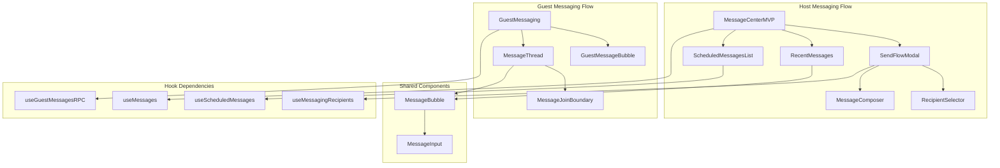
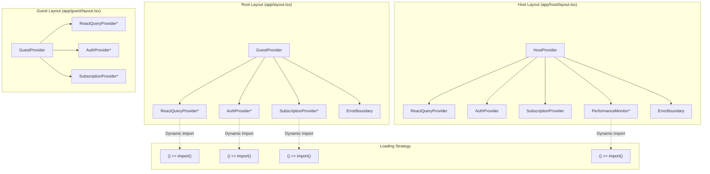
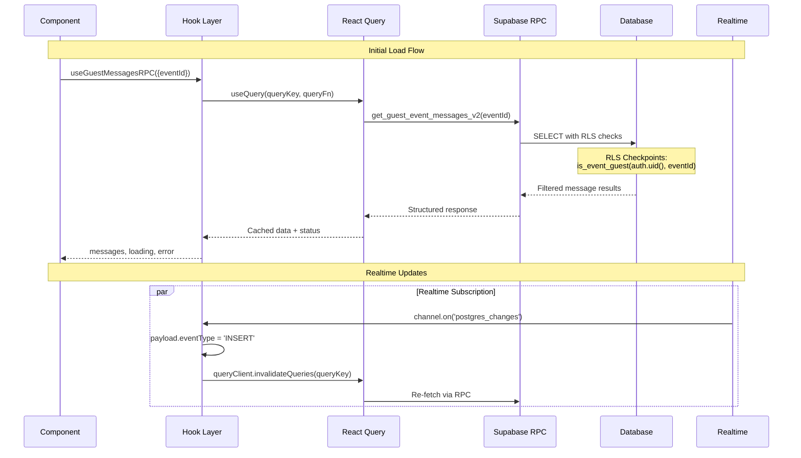
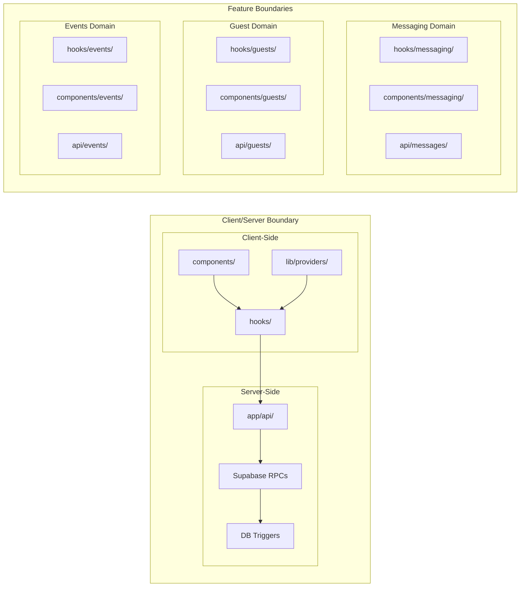

# Platform Architecture Map
*Generated: September 24, 2025*

## 🏗️ System Architecture Overview

### Component/Container Graph - Messaging System



### Provider Stack Diagram



### Data Flow - Messages Read Model



### Module Boundaries & Dependencies



## 🎯 Component Analysis

### Messaging Components Complexity

| Component | Lines | Dependencies | Role | Complexity |
|-----------|-------|-------------|------|------------|
| `MessageCenterMVP` | 420 | 8 hooks | Container | High |
| `GuestMessaging` | 350 | 6 hooks | Container | High |
| `SendFlowModal` | 280 | 5 hooks | Container | Medium |
| `RecipientSelector` | 245 | 4 hooks | Container | Medium |
| `MessageThread` | 180 | 3 hooks | UI | Low |
| `MessageBubble` | 120 | 1 hook | UI | Low |

### Hook Dependency Graph

**High Fan-out Hooks (Most Dependencies):**
1. `useMessages` → 8 internal dependencies 
2. `useScheduledMessages` → 6 internal dependencies
3. `useGuestMessagesRPC` → 5 internal dependencies
4. `useMessagingRecipients` → 4 internal dependencies

**Heavy Hooks (Most Complex):**
1. `useGuestMessagesRPC` - 793 lines, complex RPC logic
2. `useScheduledMessages` - 420 lines, multiple concerns
3. `useMessages` - 197 lines, realtime + queries
4. `SubscriptionManager` - 1,255 lines, lifecycle mgmt

## 🔄 Realtime Architecture

### Subscription Lifecycle

```mermaid
stateDiagram-v2
    [*] --> Creating
    Creating --> Connecting: channel.subscribe()
    Connecting --> Connected: success
    Connecting --> Error: failure
    
    Connected --> Disconnected: network/auth issue
    Error --> Reconnecting: retry logic
    Disconnected --> Reconnecting: auto-reconnect
    
    Reconnecting --> Connected: success + backoff reset
    Reconnecting --> Error: failure + backoff increment
    
    Connected --> Cleaning: component unmount
    Error --> Cleaning: max retries exceeded
    Cleaning --> [*]: channel.unsubscribe()
    
    note right of Reconnecting
        Exponential backoff:
        2s → 4s → 8s → 30s max
    end note
```



### Current Subscription Patterns

| Hook | Pattern | Concerns |
|------|---------|----------|
| `useEventSubscription` | Direct channel mgmt | Memory leaks possible |
| `useOptimizedRealtimeSubscription` | Centralized manager | Complex lifecycle |
| `useScheduledMessagesRealtime` | Cache integration | Tight coupling |
| `useRealtimeHealth` | Health monitoring | Performance overhead |

## 🧩 Anti-Pattern Analysis

### 1. Hook Proliferation
**Current State:** 15+ messaging-related hooks with overlapping concerns

**Example Pattern:**
```typescript
// Scattered across multiple files:
useMessages()           // Base messaging
useGuestMessagesRPC()   // Guest-specific  
useScheduledMessages()  // Scheduled messages
useCurrentAudienceCount() // Recipient counting
useMessagingRecipients()  // Recipient management
```

**Target Consolidation:**
```typescript  
// Consolidated approach:
useMessaging()          // Core messaging with role detection
useMessageRecipients()  // Unified recipient management  
useRealtimeSubscription() // Standardized realtime
```

### 2. Query Key Inconsistency
**Current Patterns Found:**
```typescript
// 171 variations across codebase:
['messages', eventId]
['guest-messages', eventId] 
['scheduled-messages', eventId, filters]
['event-messages', eventId]
// ... many more inconsistent patterns
```

**Target Factory Pattern:**
```typescript
const QueryKeys = {
  messages: (eventId: string) => ['messages', eventId] as const,
  scheduledMessages: (eventId: string, filters?: any) => 
    ['messages', 'scheduled', eventId, filters] as const,
  // Centralized, type-safe, consistent
}
```

### 3. Provider Loading Strategy
**Current Issue:** Heavy providers loaded synchronously in shared bundle

**Bundle Impact:**
- React Query: ~85KB
- Supabase Client: ~122KB  
- Realtime: ~40KB
- Total: ~247KB in shared chunk

**Optimization Strategy:**
```typescript
// Current: Synchronous loading
import { ReactQueryProvider } from '@/lib/react-query-client';

// Target: Route-based code splitting
const ReactQueryProvider = dynamic(() => import('@/lib/react-query-client'), {
  loading: () => <LoadingSpinner />,
  ssr: false
});
```

## 🎯 Architecture Recommendations

### 1. Messaging Hook Consolidation
**Target:** 15 hooks → 5 core hooks
- `useMessaging()` - Unified messaging interface
- `useMessageComposer()` - Message creation/sending
- `useMessageRecipients()` - Recipient management
- `useRealtimeSync()` - Standardized realtime
- `useMessageAnalytics()` - Metrics and insights

### 2. Provider Optimization
**Target:** Reduce shared chunk by 150KB
- Route-based provider loading
- Lazy-loaded heavy dependencies
- Progressive enhancement for non-critical features

### 3. Query Key Standardization  
**Target:** Centralized key factory pattern
- Type-safe query key generation
- Consistent invalidation patterns
- Hierarchical cache management

### 4. Realtime Subscription Cleanup
**Target:** Single subscription manager pattern
- Centralized lifecycle management
- Automatic cleanup and memory leak prevention
- Standardized error handling and retry logic

---

*This architecture map provides the foundation for the refactoring plan outlined in `foundations_refactor_plan_20250924.md`*
