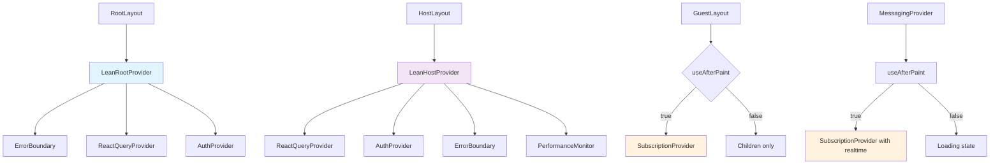

# Architecture & Route Map
*Generated: September 26, 2025*
*Analysis Type: Code-only, no runtime changes*

## App Router Structure

### Route Hierarchy
```
app/
├── layout.tsx                     # Root layout with LeanRootProvider
├── page.tsx                       # Splash → /select-event or /login
├── global-error.tsx               # Global error boundary with Sentry
├── (auth)/                        # Auth route group
│   ├── layout.tsx                 # Auth layout (minimal)
│   ├── login/page.tsx             # Magic link auth
│   ├── setup/page.tsx             # Profile setup
│   ├── select-event/page.tsx      # Event selection (server wrapper)
│   └── profile/page.tsx           # User profile management
├── (core)/                        # Core route group  
│   └── layout.tsx                 # Server-only core layout
├── guest/                         # Guest route group
│   ├── layout.tsx                 # Client layout with deferred SubscriptionProvider
│   └── events/[eventId]/
│       ├── page.tsx               # Event join gate
│       ├── layout.tsx             # Event-specific layout
│       ├── home/page.tsx          # Guest event dashboard (client)
│       └── schedule/page.tsx      # Event schedule view (client)
├── host/                          # Host route group
│   ├── layout.tsx                 # Client layout with LeanHostProvider
│   └── events/
│       ├── create/page.tsx        # Create event form
│       └── [eventId]/
│           ├── dashboard/page.tsx # Host dashboard
│           ├── details/page.tsx   # Event details/editing
│           ├── edit/page.tsx      # Event form editing
│           ├── schedule/page.tsx  # Schedule management
│           ├── guests/page.tsx    # Guest management
│           └── messages/
│               ├── page.tsx       # Message center (with MessagingProvider)
│               ├── analytics/page.tsx
│               └── compose/page.tsx
└── api/                           # API routes (15 routes)
    ├── auth/, cron/, guests/, messages/, sms/, webhooks/
    └── admin/ (backfill, test-users)
```

### Server vs Client Pages

**Server Components** (faster initial render):
- `app/layout.tsx` - Root layout with minimal providers
- `app/(core)/layout.tsx` - Server-only core layout
- `app/(auth)/select-event/page.tsx` - Server wrapper for EventSelectionClient

**Client Components** (interactive):
- `app/page.tsx` - Splash page with auth redirect logic
- `app/guest/events/[eventId]/home/page.tsx` - Guest dashboard with messaging
- `app/host/events/[eventId]/messages/page.tsx` - Host message center
- All dynamic route pages requiring user interaction

**Hybrid Strategy**:
- Server wrappers for critical routes with client interactivity isolated
- Deferred provider mounting for performance optimization

## Provider Architecture



### Provider Mount Strategy

**Post-Paint Mounting** (LCP optimization):
- `useAfterPaint()` hook defers heavy providers until after first paint
- Used in: `GuestLayout`, `HostProvider`, `MessagingProvider`
- Performance marks: `perf:providers:defer-start` → `perf:providers:after-paint`

**Lean Provider Hierarchy**:
1. **LeanRootProvider**: ErrorBoundary + ReactQuery + Auth only
2. **LeanHostProvider**: + PerformanceMonitor (no realtime for non-messaging routes)
3. **SubscriptionProvider**: Full realtime (deferred to messaging routes)
4. **MessagingProvider**: Realtime-specific provider for message routes

## Data Flow Analysis

### Critical Route: `/select-event`
**Server-first Strategy**:
- Server component wrapper → `EventSelectionClient`  
- Initial render: Server-side event list via `get_user_events` RPC
- Client hydration: Interactive event selection

**Data Sources**:
- `get_user_events()` RPC (RLS-secured, host/guest events)
- `useUserEvents()` hook for client-side state management

### Critical Route: `/guest/events/[eventId]/home`
**Client-heavy Strategy**:
- `useEventWithGuest()` - Event data + guest relationship
- `useAfterPaint()` - Deferred messaging components
- Dynamic imports: `GuestMessaging`, `DeclineEventModal`

**Data Sources**:
- `get_guest_event_messages_v2()` RPC (union read-model)
- Realtime: `useEventSubscription()` for RSVP status changes
- `useRealtimeSubscription()` for message updates

### Critical Route: `/guest/events/[eventId]/messages` (Host)
**Heavy Provider Strategy**:
- `MessagingProvider` with full realtime stack
- `MessageCenter` with lazy-loaded `MessageCenter` component
- `SubscriptionProvider` availability check: `useSubscriptionManager()`

**Data Sources**:
- `useMessages()` - Host message history with sender info
- `useScheduledMessages()` - Future message management  
- Realtime: Multi-table subscriptions (messages, deliveries, scheduled)

## Heavy UI Component Inventory

### 1. Emoji Picker
**File**: `components/features/messaging/host/RecipientSelector.tsx`
**Load Strategy**: Inline (small emoji map, no external library)
**Size Impact**: Minimal (hardcoded emoji mappings)

### 2. Media Uploader  
**File**: `components/features/media/PhotoUpload.tsx`
**Load Strategy**: Direct import (critical for UX)
**Features**: Image compression, drag/drop, mobile camera integration
**Size Impact**: ~10KB (canvas-based compression)

### 3. Rich Editor
**Current**: Plain text only in `MessageComposer`
**Load Strategy**: N/A (plain text with character counter)
**Future Enhancement**: Dynamic import for rich text mode

### 4. Photo Gallery & Lightbox
**Files**: 
- `components/features/media/GuestPhotoGallery.tsx`
- `MediaModal` component (inline)
**Load Strategy**: Gallery immediate, modal on-demand
**Features**: Navigation, fullscreen view, keyboard controls

### 5. Maps/Location (Future)
**Status**: Not implemented
**Planned Strategy**: Dynamic import for location features

### 6. Dynamic Modals
**Files**:
- `DeclineEventModal` (dynamic import, SSR disabled)
- Various confirmation modals
**Load Strategy**: Import on user interaction

## Bundle Analysis - Critical Routes

### Build Output Summary
```
Main Bundle Sizes:
- main-app.js: 676KB (exceeds 244KB limit)
- main.js: 549KB  
- Framework chunks: ~183KB base

Critical Route Entrypoints:
- select-event: 292KB
- guest/home: 340KB (heaviest)
- host/messages: (not in build output - likely code-split)
```

### Chunk Breakdown - `/guest/events/[eventId]/home` (340KB)
```
Base chunks (shared):
- 6569-f49ac156eadd4015.js (shared utils)
- 5161-285b54ce3e2256ba.js (UI components)  
- 537-579aa1eb07b5777b.js (auth/providers)
- 2581-14a87bc34575f658.js (shared business logic)
- 7639-a7040fd25862be0e.js (query/hooks)

Route-specific:
- 4396-f951e3d6e3bdc9dd.js (messaging components)
- 3987-e5790b7629ed2b73.js (realtime subscriptions)
- 4096-b82ccb86c111ccd6.js (event management)
- 9043-8280b8c6a07fa103.js (guest features)
- 5392-c0e1b48847c21619.js (UI interactions)  
- 3642-feb98f3407e1c1c4.js (media/photo features)
- 2766-67f7b2c1d1e8ab96.js (schedule/calendar)
```

### Chunk Breakdown - `/select-event` (292KB)
```
Optimized chunking:
- Lighter than guest/home (no messaging/realtime)
- Shares base chunks but excludes heavy features
- Server-first approach reduces client-side overhead
```

## Safe Optimization Opportunities

### 1. Further Code Splitting
- **PhotoGallery**: Move to dynamic import (save ~20KB on initial load)
- **MediaModal**: Already dynamically loaded ✅
- **DeclineEventModal**: Already dynamically loaded ✅  
- **PerformanceMonitor**: Gate behind dev/staging flag

### 2. Server-First Candidates
- **Event Schedule**: Currently client-rendered, could be server-first
- **Guest List**: Move to server rendering with client interactivity
- **Event Details**: Hybrid server/client approach

### 3. Bundle Optimization
- **Main bundle warning**: 676KB → Target 400KB
  - Move React Query devtools to development-only
  - Audit @tanstack/react-query bundle impact
  - Consider lazy loading PerformanceMonitor
  
### 4. Dynamic Import Opportunities
- **Chart libraries**: None currently used (future enhancement)
- **Date picker**: Heavy date libraries not detected
- **Export functionality**: Not implemented yet

### 5. Provider Optimization
- **SubscriptionProvider**: Further defer until user interaction
- **PerformanceMonitor**: Conditional loading based on environment
- **DevToolsGate**: Already properly gated ✅

### 6. Realtime Subscription Optimization  
- **Single subscription**: Ensure no duplicate channels (audit needed)
- **Connection pooling**: Validate SubscriptionProvider efficiency
- **Deferred connection**: Further delay until user scrolls/interacts

### 7. Asset Optimization
- **Image formats**: AVIF/WebP already configured ✅
- **Font loading**: Preconnect to Google Fonts configured ✅
- **Icon optimization**: SVG icons already optimized

### 8. Route-Level Optimization
- **Middleware optimization**: Review current middleware for performance
- **Static generation**: Identify routes that could be statically generated
- **Edge runtime**: Consider API route migration to edge

### 9. Third-Party Bundle Analysis
**Largest Contributors** (estimated):
- `@supabase/supabase-js` + realtime: ~150KB
- `@tanstack/react-query`: ~50KB  
- `lucide-react`: Optimized with modular imports ✅
- `next`: Framework overhead ~180KB

### 10. Mobile-First Optimizations
- **Viewport-based loading**: Implement intersection observer for below-fold components
- **Touch-optimized chunking**: Separate touch vs desktop interaction code
- **Progressive enhancement**: Ensure core functionality works without JS

---

## Action Items (Quick Wins ≤1h)

1. **Dynamic PhotoGallery import** - Save 20KB on initial load
2. **Conditional PerformanceMonitor** - Development/staging only  
3. **Audit duplicate subscriptions** - Single channel per scope validation
4. **Bundle analyzer integration** - Add to CI/CD for ongoing monitoring
5. **Server-first schedule view** - Convert guest schedule to SSR + client enhancement

## Next Steps

This analysis reveals a well-architected system with thoughtful provider optimization and code splitting. The main opportunities lie in:

1. Further dynamic imports for media-heavy components
2. Server-first rendering for read-heavy routes  
3. Bundle size optimization focusing on the 676KB main-app bundle
4. Realtime subscription efficiency audit

The architecture demonstrates strong separation of concerns with the provider hierarchy and effective use of Next.js App Router patterns.
