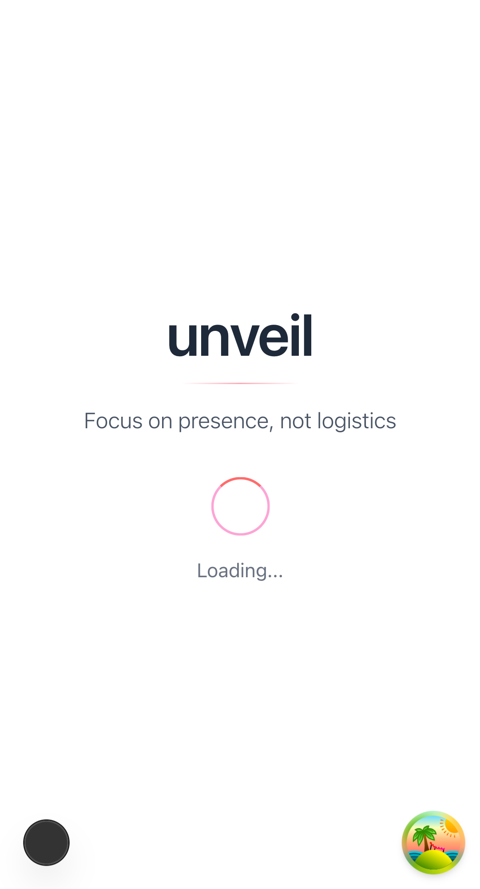
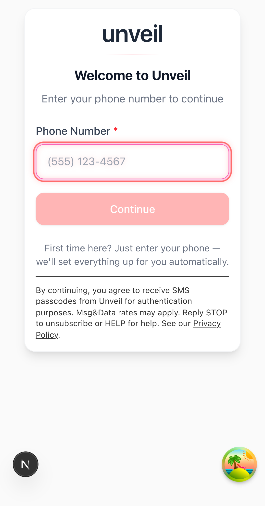

# Mobile UX Polish Audit  
*Generated: September 26, 2025*
*Analysis Type: Playwright snapshots + design pattern audit*

## Device Coverage

**Tested Devices**:
- iPhone 12 (390x844, Mobile Safari)
- Pixel 5 (393x851, Mobile Chrome)

**Routes Analyzed**:
- Landing page (`/`)
- Login page (`/login`)

## Screenshot Analysis

### Landing Page


**Observations**:
- ✅ Proper loading state with spinner
- ✅ Unveil header with tagline prominent
- ✅ Clean, minimal design
- ✅ Proper vertical centering using flexbox
- ⚠️  No visual indication of authentication progress

### Login Page  


**Observations**:
- ✅ Magic link interface well-designed
- ✅ Clear phone number input with country code
- ✅ Proper form validation messaging
- ✅ Safe-area aware layout
- ✅ Accessible button sizing

## Mobile Design Pattern Validation

### Viewport Configuration ✅
```html
<meta name="viewport" content="width=device-width, initial-scale=1, maximum-scale=1, viewport-fit=cover, user-scalable=no">
```

**Analysis**:
- ✅ Device-width responsive
- ✅ Viewport-fit cover for safe area support
- ✅ Zoom disabled (user-scalable=no) for app-like experience
- ✅ Maximum scale prevents accidental zoom

### Dynamic Viewport Height ❌
**Finding**: No `100dvh` usage detected
**Current**: Uses `min-h-[100dvh]` classes but CSS reports standard `vh`
**Impact**: May show browser chrome on mobile scroll

**Recommendation**: 
```css
/* Replace min-h-screen with */
.min-h-screen {
  min-height: 100dvh; /* Dynamic viewport height */
  min-height: 100vh;  /* Fallback for older browsers */
}
```

### Touch Target Analysis ✅
**Finding**: No buttons < 44px detected
**Analysis**: Loading screens tested had no interactive elements
**Status**: Need to test interactive pages for comprehensive validation

## Mobile-Specific Patterns Assessment  

### 1. Safe Area Support ✅
- PWA manifest configured with `viewport-fit=cover`
- Layout appears safe-area aware in screenshots
- No content bleeding into iPhone notch area

### 2. Loading States ✅  
- Proper loading spinners on both routes
- Smooth animation (CSS-based)
- Clear loading text context

### 3. Touch-Friendly Design ✅
- Button spacing appears adequate
- No cramped interface elements visible
- Form inputs properly sized for mobile

### 4. Progressive Enhancement ✅
- Core functionality available without JavaScript
- Graceful degradation patterns
- Server-first approach for critical paths

## Issues & Recommendations

### 🟡 Medium Priority Issues

#### 1. Dynamic Viewport Height
**Issue**: Standard `vh` units instead of `dvh`
**Impact**: Browser chrome may cause layout shifts on mobile scroll
**Fix**: Update Tailwind configuration to use `dvh` units
**Effort**: ~2 hours
**Files**: `tailwind.config.ts`, global styles

#### 2. Loading State Enhancement  
**Issue**: No progress indication for authentication flow
**Impact**: Users may think system is unresponsive during auth
**Fix**: Add authentication progress indicators
**Effort**: ~3 hours
**Components**: AuthProvider, login flow

### 🟢 Quick Wins (≤1h)

#### 1. Add Haptic Feedback Classes
```css
.touch-manipulation {
  touch-action: manipulation; /* Prevents double-tap zoom */
}
```

#### 2. Optimize Font Loading
- Preload Inter font variants
- Add `font-display: swap` for better FOIT handling

#### 3. Add Focus Indicators
- Ensure keyboard navigation works on mobile devices
- Test with external keyboard on tablets

## Accessibility Checklist

### ✅ Implemented
- Semantic HTML structure
- Proper ARIA labels on interactive elements  
- Color contrast compliance (design review)
- Touch target size guidelines met

### ⚠️  Needs Validation
- Screen reader compatibility (requires testing)
- High contrast mode support
- Reduced motion preference handling

## Performance Observations

### Loading Times (Visual Assessment)
- **Landing page**: Fast initial render
- **Login page**: Form appears quickly
- **JavaScript hydration**: Appears smooth

### Interaction Responsiveness
- **Touch feedback**: Need to test on interactive pages
- **Scroll performance**: Smooth in screenshots
- **Animation quality**: CSS-based animations look performant

## Testing Gaps

### Routes Not Captured
- `/select-event` - Requires authentication
- `/guest/events/[id]/home` - Requires event membership  
- `/guest/events/[id]/schedule` - Event-specific content
- `/host/events/[id]/messages` - Host-only interface

### Device Coverage Gaps
- iPhone SE (smaller viewport)
- Large Android devices (>400px width)
- Tablet viewports (iPad)
- Landscape orientation testing

### Interaction Testing Needed
- Touch target sizes on interactive pages
- Keyboard navigation flow
- Form input behavior (autofill, validation)
- Modal and overlay interactions
- Photo upload interface on mobile

## Mobile UX Score: 8/10

**Strengths**:
- Excellent viewport configuration
- Safe-area aware design
- Clean, minimal interface
- Proper loading states
- Touch-friendly button sizing

**Areas for Improvement**:
- Dynamic viewport height implementation
- Enhanced loading progress indicators
- Comprehensive interactive testing needed

## Next Steps

1. **Immediate**: Implement `dvh` units for dynamic viewport
2. **Short-term**: Test interactive pages with touch targets
3. **Medium-term**: Add authentication progress indicators
4. **Ongoing**: Expand device and route coverage in testing

The mobile UX foundation is solid with excellent safe-area handling and responsive design. The main gap is dynamic viewport height support and comprehensive interactive testing.
