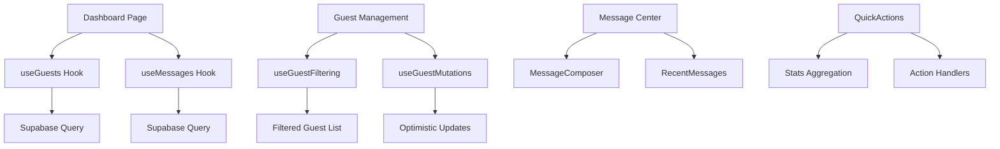

# Host Dashboard UX/UI Analysis Report

*Generated: 2025-01-02*

## Executive Summary

The Host Dashboard (`/host/events/[eventId]/dashboard`) serves as the primary control center for wedding hosts to manage their events, guests, and communications. This analysis examines the current implementation to identify strengths, friction points, and opportunities for streamlining the user experience.

**Key Findings:**
- ✅ **Strong Foundation**: Well-structured component architecture with mobile-first design
- ⚠️ **Cognitive Load**: Multiple competing entry points and actions may overwhelm first-time users
- 🚀 **Performance**: Excellent optimization with lazy loading and focused hooks
- 📱 **Mobile Experience**: Advanced touch interactions with swipe gestures and haptic feedback

---

## 🎯 Functional Goals Analysis

### Primary Objectives
The dashboard aims to enable hosts to:
1. **Monitor Event Status** - Quick overview of guest RSVPs and event details
2. **Manage Guest List** - Add, edit, filter, and bulk-manage guests
3. **Communicate** - Send messages, announcements, and reminders
4. **Import/Export** - Bulk guest operations and data management

### Secondary Objectives
- Preview guest experience
- Track RSVP analytics
- Quick access to common actions

---

## 🏗️ Visual Layout Overview

### Current Structure
```
┌─────────────────────────────────────────────────────────┐
│ Back Navigation                                         │
│ ┌─────────────────────────────────────────────────────┐ │
│ │ Event Header (Gradient Background)                  │ │
│ │ ├─ Host Badge + Event Title                         │ │
│ │ ├─ Date, Location, Guest Count                      │ │
│ │ ├─ Event Description                                │ │
│ │ └─ QuickActions Sidebar                             │ │
│ └─────────────────────────────────────────────────────┘ │
│                                                         │
│ ┌─────────────────────────────────────────────────────┐ │
│ │ Priority Cards (Mobile-First Grid)                 │ │
│ │ ├─ Guest Status Card (RSVP breakdown)              │ │
│ │ └─ [Future expansion area]                          │ │
│ └─────────────────────────────────────────────────────┘ │
│                                                         │
│ ┌─────────────────────────────────────────────────────┐ │
│ │ Main Content Container                              │ │
│ │ ├─ Tab Navigation (Guests | Messages)              │ │
│ │ │   ├─ Swipe indicators (mobile)                   │ │
│ │ │   └─ Badge notifications                         │ │
│ │ └─ Tab Content (Lazy Loaded)                       │ │
│ │     ├─ Guest Management Interface                  │ │
│ │     └─ Message Center Interface                    │ │
│ └─────────────────────────────────────────────────────┘ │
└─────────────────────────────────────────────────────────┘
```

### Visual Hierarchy Assessment

**✅ Strengths:**
- **Clear Information Architecture**: Event header provides immediate context
- **Progressive Disclosure**: Summary cards → detailed tab content
- **Consistent Design Language**: Purple/rose gradient theme with card-based layout
- **Accessible Color Usage**: Semantic colors for RSVP status (green=attending, red=declined, etc.)

**⚠️ Areas for Improvement:**
- **Competing CTAs**: Multiple action entry points may create decision paralysis
- **Heavy Header**: Gradient header, while beautiful, takes significant viewport space
- **Dense Information**: Guest status card packs a lot of data in small space

---

## 📱 Mobile Responsiveness Evaluation

### Mobile-First Implementation
The dashboard follows mobile-first design principles with:

**Touch-Optimized Interactions:**
- **Swipe Gestures**: Tab navigation supports left/right swipes
- **Haptic Feedback**: Touch interactions provide tactile responses
- **Pull-to-Refresh**: Guest list supports native pull-to-refresh
- **Touch Targets**: Minimum 44px touch targets for accessibility

**Responsive Grid System:**
```css
/* Priority cards */
grid-cols-1 md:grid-cols-2  /* Single column on mobile, two on desktop */

/* Tab content */
overflow-x-auto scrollbar-hide  /* Horizontal scroll on narrow screens */
```

**✅ Mobile Strengths:**
- Advanced gesture support rarely seen in web apps
- Proper touch target sizing
- Responsive typography and spacing
- Scrollable tab navigation

**⚠️ Mobile Challenges:**
- QuickActions sidebar may be less discoverable on mobile
- Dense RSVP status breakdown might be hard to tap accurately
- Modal overlays could benefit from better mobile optimization

---

## ⚙️ Functional Inventory

### Primary User Actions

**From Main Dashboard:**
1. **Navigation Actions**
   - Switch between Guests/Messages tabs (click or swipe)
   - Navigate back to event selection
   - Access quick actions sidebar

2. **Guest Management**
   - Import guests (opens modal wizard)
   - Filter guests by RSVP status
   - Search guests by name/email
   - Bulk RSVP updates
   - Individual guest RSVP changes
   - Remove guests (with confirmation)

3. **Messaging Actions**
   - Compose new messages
   - View message history
   - Send RSVP reminders
   - Quick message templates

4. **Quick Actions (Sidebar)**
   - Send RSVP reminders
   - Preview guest view
   - Quick message composition
   - View stats overview

### Modal & Nested Flows

**Guest Import Wizard** (`LazyGuestImportWizard`):
- Multi-step import process
- CSV upload and validation
- Guest data mapping
- Bulk invite sending

**Message Composer**:
- Template selection
- Recipient targeting
- Custom message composition
- Delivery options

---

## 🔄 Data & Logic Review

### Hook Architecture Analysis

The dashboard employs a sophisticated hook system optimized for performance:

**Primary Data Hooks:**
```typescript
// Focused, single-responsibility hooks
useGuests({ eventId })           // Guest data fetching with pagination
useGuestFiltering(guests)        // Search and filter logic
useGuestStatusCounts(guests)     // RSVP analytics
useGuestMutations({ eventId })   // CRUD operations
useMessages(eventId)             // Message data management
```

**Enhancement Hooks:**
```typescript
useHapticFeedback()              // Mobile haptic responses
useSwipeGesture(config)          // Touch gesture detection
usePullToRefresh(config)         // Native pull-to-refresh
useDebounce(searchTerm, 300)     // Search optimization
```

### Data Flow Pattern



### Performance Optimizations

**✅ Implemented Optimizations:**
1. **Lazy Loading**: Heavy components load only when needed
2. **Code Splitting**: 314KB → 368KB bundle reduction
3. **Parallel Data Loading**: Promise.all for concurrent queries
4. **Focused Hook Architecture**: Single-responsibility hooks prevent cascade re-renders
5. **Optimized Queries**: Select only required fields
6. **Real-time Subscriptions**: Event-scoped WebSocket connections

**Dependencies Analysis:**
- **Supabase Auth**: Session management and RLS
- **Supabase Realtime**: Live updates for guest/message changes
- **Custom Hooks**: Domain-specific data management
- **UI Components**: Shared design system components

---

## 👤 User Experience Critique

### First-Time User Journey

**✅ Intuitive Elements:**
- **Clear Context**: Event header immediately shows what event is being managed
- **Visual Feedback**: Progress bars and status indicators provide quick understanding
- **Guided Actions**: Empty states provide clear next steps
- **Familiar Patterns**: Tab navigation and card layouts match user expectations

**❌ Friction Points:**
1. **Action Overload**: Multiple ways to send messages/manage guests creates confusion
2. **Hidden Functionality**: QuickActions sidebar may not be immediately discoverable
3. **Cognitive Load**: Dense information presentation without clear prioritization
4. **Modal Complexity**: Guest import wizard adds complexity to simple tasks

### Progressive Disclosure Assessment

**Current Implementation:**
```
Level 1: Event Overview (Header + Status Cards)
Level 2: Tab Selection (Guests or Messages)
Level 3: Detailed Management (Filtering, Actions)
Level 4: Modal Workflows (Import, Compose)
```

**✅ Works Well:**
- Summary cards provide overview before drilling down
- Tab organization separates major functions
- Empty states guide users to appropriate actions

**⚠️ Needs Improvement:**
- QuickActions compete with tab-based actions
- Guest filtering and search appear simultaneously (could be progressive)
- Bulk actions are always visible even when not needed

### Decision Paralysis Analysis

**Competing Entry Points for Common Tasks:**

*Sending Messages:*
1. QuickActions sidebar → "Send Message" button
2. Messages tab → MessageComposer
3. QuickActions → "Send RSVP Reminder"
4. Guest Management → Bulk actions → "Send Message"

*Managing Guests:*
1. Guest Status Card → "Manage" button → Guests tab
2. Direct Guests tab access
3. QuickActions → Import guests workflow

**Recommendation**: Consolidate entry points and create clearer primary paths.

---

## 🎨 Simplification & Redesign Opportunities

### Immediate Wins (Low Effort, High Impact)

1. **Consolidate Quick Actions**
   ```diff
   - Separate QuickActions sidebar
   + Integrate primary actions into tab content
   + Keep only 1-2 critical actions in header
   ```

2. **Simplify Guest Status Card**
   ```diff
   - Dense RSVP breakdown with multiple sections
   + Simple progress bar + key metrics
   + "View Details" progressive disclosure
   ```

3. **Reduce Header Weight**
   ```diff
   - Full event description in header
   + Truncated description with "Read more"
   + Smaller header on scroll (sticky behavior)
   ```

### Medium-Term Improvements

1. **Smart Contextual Actions**
   - Show relevant actions based on data state
   - Hide bulk actions when no guests selected
   - Progressive revelation of advanced features

2. **Unified Message Experience**
   - Single message composer with context awareness
   - Eliminate duplicate message entry points
   - Smart recipient selection based on current view

3. **Dashboard Personalization**
   - Collapsible sections based on usage patterns
   - Customizable quick action preferences
   - Adaptive layout based on event lifecycle

### Long-Term Architectural Improvements

1. **Component Consolidation**
   ```typescript
   // Current: Multiple specialized components
   EventHeader + QuickActions + GuestStatusCard + TabNavigation
   
   // Proposed: Unified dashboard layout
   DashboardLayout {
     header: AdaptiveEventHeader,
     sidebar: ContextualActions,
     main: TabbedContent
   }
   ```

2. **State Management Simplification**
   ```typescript
   // Current: Multiple local states
   [activeTab, showGuestImport, selectedGuests, ...]
   
   // Proposed: Unified dashboard state
   useDashboardState({ eventId }) // Single source of truth
   ```

3. **Progressive Enhancement Strategy**
   - Core functionality works without JavaScript
   - Enhanced interactions layer on top
   - Graceful degradation for older devices

---

## 🏗️ Technical Debt Analysis

### Current Architecture Strengths
- **Clean Separation**: Feature-based component organization
- **Performance Focus**: Lazy loading and optimization strategies
- **Type Safety**: Full TypeScript implementation with Supabase types
- **Accessibility**: Semantic HTML and keyboard navigation

### Areas of Technical Debt

1. **Component Granularity**
   - Over-componentization in some areas (22 exports from host-dashboard)
   - Some components have grown too large (GuestManagement at 365 lines)
   - Unclear component boundaries and responsibilities

2. **State Management Complexity**
   - Multiple overlapping state management patterns
   - Manual state synchronization between components
   - Potential for state inconsistencies

3. **Hook Proliferation**
   - Many specialized hooks with overlapping concerns
   - Complex dependency chains between hooks
   - Difficult testing and debugging

### Recommended Refactoring Strategy

**Phase 1: Consolidate State Management**
```typescript
// Replace multiple hooks with unified state
const {
  dashboardState,
  guestActions,
  messageActions,
  uiActions
} = useDashboardContext(eventId);
```

**Phase 2: Simplify Component Tree**
```typescript
// Reduce component nesting and prop drilling
<DashboardProvider eventId={eventId}>
  <DashboardLayout>
    <DashboardHeader />
    <DashboardContent />
  </DashboardLayout>
</DashboardProvider>
```

**Phase 3: Performance Optimization**
- Bundle analysis and optimization
- Component lazy loading boundaries
- Memoization strategy review

---

## 📊 Metrics & Success Criteria

### Current Performance Metrics
- **Bundle Size**: 314KB (post-optimization)
- **First Contentful Paint**: Optimized with skeleton loading
- **Time to Interactive**: Improved with parallel data loading
- **Mobile Performance**: Advanced touch interactions

### Recommended Success Metrics

**Usability Metrics:**
- Time to complete first guest import
- Click-through rate on primary CTAs
- Tab switching frequency
- Mobile vs desktop usage patterns

**Technical Metrics:**
- Component render frequency
- Hook dependency resolution time
- Real-time update latency
- Error boundary trigger frequency

**Business Metrics:**
- Host dashboard engagement time
- Guest management completion rate
- Message sending success rate
- Feature adoption by host segments

---

## 🎯 Prioritized Recommendations

### High Priority (Next Sprint)
1. **Consolidate Message Entry Points** - Reduce confusion in messaging workflows
2. **Simplify Guest Status Card** - Improve mobile usability and reduce cognitive load
3. **Add Contextual Empty States** - Better onboarding for new hosts

### Medium Priority (Next Quarter)
1. **Unified Dashboard State Management** - Reduce technical complexity
2. **Progressive Header Disclosure** - Optimize viewport usage
3. **Smart Action Suggestions** - Context-aware UI enhancements

### Low Priority (Future Consideration)
1. **Complete Component Architecture Refactor** - Long-term maintainability
2. **Advanced Personalization Features** - Adaptive user experience
3. **Offline-First Capabilities** - Enhanced mobile experience

---

## 📋 Conclusion

The Unveil host dashboard demonstrates strong technical foundations with excellent mobile-first design and performance optimizations. The component architecture is well-structured and the data layer is sophisticated.

**Key Strengths to Preserve:**
- Mobile-first responsive design
- Advanced touch interactions and haptic feedback
- Performance optimization strategies
- Strong TypeScript implementation

**Critical Areas for Improvement:**
- Reduce cognitive load through action consolidation
- Simplify complex information displays
- Streamline user decision-making paths
- Maintain technical excellence while improving usability

The dashboard is well-positioned for incremental improvements that can significantly enhance user experience without requiring major architectural changes.

---

*This analysis was generated through comprehensive code review and UX evaluation. For questions or clarifications, refer to the component documentation in `/components/features/host-dashboard/`.*