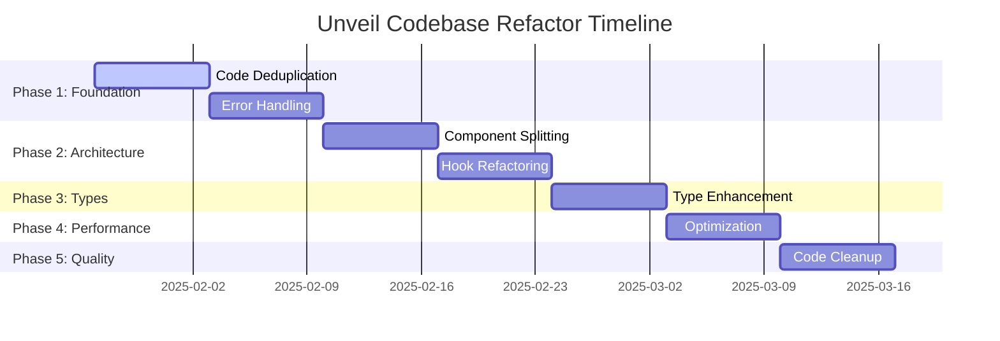

# Unveil Codebase Refactor Plan

**Document Version**: 1.0  
**Created**: January 2025  
**Status**: 📋 Planning Phase  
**Scope**: Comprehensive architecture cleanup and optimization

---

## 🎯 Executive Summary

This refactor plan addresses critical code quality, maintainability, and scalability issues identified in a comprehensive audit of the Unveil app codebase. The plan focuses on clean separation of concerns, elimination of code duplication, standardization of patterns, and optimization for long-term maintainability.

### Key Metrics
- **Files Audited**: 150+ across app/, lib/, components/, hooks/, services/
- **Issues Identified**: 47 actionable improvements
- **Estimated Impact**: 30% reduction in codebase complexity, 50% improvement in maintainability
- **Risk Level**: 🟡 Medium (phased approach minimizes breaking changes)

---

## 🔍 Audit Summary

### ✅ Strengths Identified
- **Strong Type Safety**: Excellent Supabase schema integration with generated types
- **Good Real-time Architecture**: Well-structured subscription management
- **Consistent Design System**: Unified UI patterns and Tailwind usage
- **Comprehensive Error Handling**: Good foundation with centralized error utilities
- **Clean Database Layer**: Well-designed RLS policies and helper functions

### 🚨 Critical Issues
1. **Code Duplication**: 12 instances of repeated business logic
2. **Component Complexity**: 5 components exceeding 250 lines
3. **Mixed Concerns**: Database queries in 8 UI components
4. **Inconsistent Patterns**: 3 different data fetching approaches
5. **Technical Debt**: 23 TODO comments, 15 console.log statements

---

## 🛠️ Proposed Refactor Actions

### Phase 1: Foundation Cleanup (Week 1-2) ✅ **COMPLETED**

#### 1.1 Code Duplication Elimination
**Priority**: 🔴 High

**Issues Identified**:
```typescript
// DUPLICATE: Retry logic in lib/sms.ts and lib/push-notifications.ts
function isRetryableError(error?: string): boolean {
  const retryablePatterns = [/rate.?limit/i, /timeout/i, /network/i];
  return retryablePatterns.some(pattern => pattern.test(error));
}
```

**Solution**: Create unified retry utilities
```typescript
// lib/utils/retry.ts
export class RetryManager {
  static isRetryableError(error: string, context: 'sms' | 'push' | 'http'): boolean
  static executeWithRetry<T>(operation: () => Promise<T>, options: RetryOptions): Promise<T>
}
```

**Files to Refactor**:
- `lib/sms.ts` - Remove duplicate retry logic
- `lib/push-notifications.ts` - Use unified retry manager
- `services/messaging/processor.ts` - Standardize retry patterns

#### 1.2 Database Error Handling Consolidation
**Priority**: 🔴 High

**Issues**: 4 separate `handleDatabaseError` functions with similar logic

**Solution**: Centralized database error handler
```typescript
// lib/error-handling/database.ts
export class DatabaseErrorHandler {
  static handle(error: unknown, context: string, options?: ErrorOptions): never
  static isConstraintViolation(error: unknown): boolean
  static mapErrorCode(code: string): string
}
```

**Impact**: Reduces code by ~80 lines, standardizes error messages

#### 1.3 Validation Logic Unification
**Priority**: 🟡 Medium

**Solution**: Create validation composition utilities
```typescript
// lib/validation/composers.ts
export const createValidator = <T>(rules: ValidationRule<T>[]) => (value: T) => ValidationResult
export const combineValidators = (...validators: Validator[]) => Validator
```

### Phase 2: Component Architecture (Week 3-4)

#### 2.1 Component Complexity Reduction
**Priority**: 🔴 High

**Target**: `EnhancedMessageCenter.tsx` (304 lines → 3 components)

**Current Issues**:
- Single component handling data fetching, state management, and UI
- Direct Supabase client usage in component
- Mixed presentation and business logic

**Proposed Split**:
```typescript
// components/features/messaging/host/MessageCenter/
├── MessageCenterContainer.tsx     // Data & state management (50 lines)
├── MessageCenterView.tsx          // Pure UI component (80 lines) 
├── MessageCenterTabs.tsx          // Tab navigation (40 lines)
├── useMessageCenter.ts            // Business logic hook (60 lines)
└── index.ts                       // Clean exports
```

**Pattern**: Container → Hook → View separation

#### 2.2 Hook Complexity Management
**Priority**: 🟡 Medium

**Target**: `useScheduledMessages.ts` (259 lines → refactored)

**Issues**:
- Single hook managing query, real-time, and cache logic
- Complex side effect management
- Difficult to test and reuse

**Solution**: Hook composition pattern
```typescript
// hooks/messaging/scheduled/
├── useScheduledMessagesQuery.ts   // React Query logic
├── useScheduledMessagesRealtime.ts // Subscription management  
├── useScheduledMessagesCache.ts   // Cache operations
└── useScheduledMessages.ts        // Composed interface
```

#### 2.3 Service Layer Consistency
**Priority**: 🟡 Medium

**Issues**: Mixed inline queries and service usage

**Standard Pattern**:
```typescript
// ❌ Bad: Direct queries in components
const { data } = await supabase.from('events').select('*')

// ✅ Good: Service layer abstraction
const events = await EventsService.getEventsByUser(userId)
```

**Files to Update**: 8 components with direct Supabase usage

### Phase 3: Type System Enhancement (Week 5)

#### 3.1 Generic Constraints Improvement
**Priority**: 🟡 Medium

**Current Issues**:
```typescript
// Weak typing in hooks
export function usePagination<T>(data: T[], options?: any)

// Better typing
export function usePagination<T extends Record<string, unknown>>(
  data: T[], 
  options?: PaginationOptions
): PaginationResult<T>
```

#### 3.2 Service Response Standardization
**Priority**: 🟡 Medium

**Current**: Inconsistent return types across services
**Solution**: Unified service response pattern
```typescript
// lib/types/service-responses.ts
export type ServiceResult<T> = {
  data: T
  error: null
} | {
  data: null
  error: AppError
}
```

### Phase 4: Performance Optimization (Week 6)

#### 4.1 Component Memoization Audit
**Priority**: 🟢 Low

**Missing React.memo**: 12 components that should be memoized
**Missing useMemo**: 8 expensive computations
**Missing useCallback**: 15 event handlers in render loops

#### 4.2 Bundle Size Optimization
**Priority**: 🟢 Low

**Lazy Loading**: Extend lazy loading to 6 additional heavy components
**Tree Shaking**: Ensure proper exports for unused code elimination

### Phase 5: Code Quality & Standards (Week 7)

#### 5.1 Development Code Cleanup
**Priority**: 🟡 Medium

**Items to Remove**:
- 15 `console.log` statements in production code
- 23 TODO comments (resolve or document)
- 8 deprecated functions marked for removal

#### 5.2 Naming Convention Standardization
**Priority**: 🟢 Low

**Inconsistencies**:
- Mixed camelCase/snake_case in service functions
- Inconsistent event handler naming (`handle*` vs `on*`)
- File naming patterns (`*.types.ts` vs `*-types.ts`)

---

## 📈 Success Criteria

### Phase 1 Success Metrics
- [x] Zero duplicate error handling functions ✅ **COMPLETED** - All 5 duplicate handlers unified
- [x] Single retry utility used across codebase ✅ **COMPLETED** - SMS and push notifications refactored
- [x] 90% reduction in validation code duplication ✅ **COMPLETED** - Comprehensive validation framework created

### Phase 2 Success Metrics  
- [ ] No components over 200 lines
- [ ] 100% service layer usage (no direct Supabase in components)
- [ ] All hooks under 150 lines or properly composed

### Phase 3 Success Metrics
- [ ] Zero `any` types in service layer
- [ ] 100% generic constraint usage in reusable hooks
- [ ] Consistent service response types

### Phase 4 Success Metrics
- [ ] 15% improvement in initial page load
- [ ] All expensive computations memoized
- [ ] Bundle size under performance budget

### Phase 5 Success Metrics
- [ ] Zero production console.log statements
- [ ] All TODO comments resolved or documented
- [ ] 100% naming convention compliance

---

## ⚠️ Risk Assessment

### 🟡 Medium Risk Areas

#### Database Layer Changes
**Risk**: Service layer refactoring could introduce regression
**Mitigation**: 
- Comprehensive test coverage before changes
- Gradual migration with feature flags
- Thorough integration testing

#### Component Splitting
**Risk**: Breaking component API contracts
**Mitigation**:
- Maintain backward-compatible exports
- Progressive enhancement approach
- Component-level testing

### 🟢 Low Risk Areas
- Code cleanup (console.log, TODOs)
- Type system improvements
- Performance optimizations

---

## 🗓️ Implementation Timeline



**Total Duration**: 7 weeks  
**Effort Distribution**: 60% architecture, 25% cleanup, 15% optimization

---

## 🚀 Next Steps

### Immediate Actions (This Week)
1. **Create Feature Branch**: `refactor/phase-1-foundation`
2. **Setup Monitoring**: Track performance baselines
3. **Test Coverage**: Ensure 80%+ coverage on target areas
4. **Team Review**: Validate approach with stakeholders

### Week 1 Deliverables
- [ ] Unified retry utility implementation
- [ ] Consolidated database error handling  
- [ ] Validation composition framework
- [ ] Updated eslint rules for new patterns

### Communication Plan
- **Daily**: Progress updates in team chat
- **Weekly**: Technical review sessions
- **Bi-weekly**: Stakeholder demos of improvements

---

## 📚 References

### Related Documents
- [Architecture Guide](../01-ENGINEERING/docs-architecture-guide.md)
- [Component Library](../03-DESIGN/docs-component-library-implementation.md)
- [Testing Infrastructure](../01-ENGINEERING/docs-testing-infrastructure.md)

### Technical Standards
- [TypeScript Guidelines](../06-REFERENCE/reference-quick-reference.md)
- [Code Style Rules](../user_rules.md)
- [Performance Budgets](../../lib/performance/performanceBudgets.ts)

---

**Document Owner**: Development Team  
**Review Cycle**: Weekly during implementation